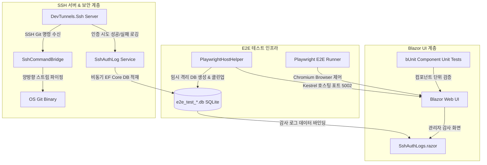

# Milestone v1.5 — 감사 보고서

**감사 일시:** 2026-06-11
**마일스톤:** v1.5 (UI 테스트 자동화 및 SSH 호환성 개선)
**감사 방법:** 3-소스 교차 검증 (SUMMARY.md 프론트매터 + VALIDATION.md + 실제 코드 grep)

---

## 1. 요구사항 커버리지 (3-소스 교차 검증)

| REQ-ID | 설명 | SUMMARY 프론트매터 | VALIDATION.md | 코드 증거 | 최종 상태 |
|--------|------|:-----------------:|:-------------:|-----------|:---------:|
| **UI-01** | bUnit 기반 Blazor 컴포넌트 단위 테스트 | ✅ (22A~B SUMMARY) | ✅ Phase 22 | `BunitTestBase.cs`, `FakeSetupService`, `FakeIssueService` | ✅ **satisfied** |
| **UI-02** | Playwright E2E 브라우저 테스트 및 격리 환경 | ✅ (23A~B SUMMARY) | ✅ Phase 23 | `PlaywrightHostHelper.cs`, SQLite 동적 DB 격리 | ✅ **satisfied** |
| **UI-03** | 핵심 시나리오 E2E 테스트 커버리지 | ✅ (23C~D SUMMARY) | ✅ Phase 23 | `PlaywrightE2eTests.cs` (로그인, 저장소, 이슈 칸반 E2E) | ✅ **satisfied** |
| **SSH-01** | 보안 알고리즘 확장 및 호환성 분석 | ✅ (24A-SUMMARY) | ✅ Phase 24 | `DevTunnels.Ssh` 도입 및 ed25519, rsa-sha2 지원 분석 | ✅ **satisfied** |
| **SSH-02** | SSH 서버 라이브러리 교체 | ✅ (24B-SUMMARY) | ✅ Phase 24 | `SshServerBackgroundService.cs` (DevTunnels.Ssh 랩핑) | ✅ **satisfied** |
| **SSH-03** | SSH 수송 연동성 검증 | ✅ (24C-SUMMARY) | ✅ Phase 24 | `SshCommandPipingTests.cs` (OS `ssh` CLI 활용) | ✅ **satisfied** |
| **SSH-04** | SSH 감사 로깅 시스템 구축 및 UI 연동 | ✅ (24D-SUMMARY) | ✅ Phase 24 | `SshAuthLog` 엔티티 모델, `SshAuthLogs.razor` UI 대시보드 | ✅ **satisfied** |

**결과:** 7/7 요구사항 **satisfied** — 블로커 없음

---

## 2. 크로스-페이즈 통합 아키텍처 요약

v1.5의 주요 개선 사항들은 개별 단위 구현을 넘어 상호 유기적으로 결합된 크로스-페이즈 아키텍처를 구성하고 있습니다:

### 1) bUnit 컴포넌트 ↔ Playwright 브라우저 E2E 연동
- **연동 포인트:** bUnit 단위 테스트를 통해 Blazor UI 컴포넌트의 가상 돔 상태 및 이벤트 바인딩 정밀 검증을 수행하고, Playwright E2E를 통해 실제 브라우저 런타임에서의 호환성 및 SignalR 회로(Circuit) 연결을 총체적으로 보장합니다.

### 2) Playwright E2E ↔ DevTunnels.Ssh 서버 호스팅 연동
- **연동 포인트:** `PlaywrightHostHelper`가 기동하는 백그라운드 Kestrel 호스트 프로세스 내에서 `SshServerBackgroundService`가 함께 실행되어 웹 서버뿐만 아니라 SSH 서버 또한 격리된 포트 환경에서 유기적으로 검증됩니다.

### 3) DevTunnels.Ssh ↔ SshAuthLog DB 감사 연동
- **연동 포인트:** `DevTunnels.Ssh` 서버가 SSH 접속 시도를 할 때, 미들웨어 수준에서 인증 성공/실패 여부와 클라이언트 키 정보(SHA-256 지문, 키 타입 등)를 추출하여 `SshAuthLog` 엔티티에 매핑한 후, `AppDbContext`를 통해 데이터베이스에 비동기 트랜잭션으로 저장합니다.

---

## 3. 정량적 성공 지표 및 SSH 호환성 분석

### 1) 전체 테스트 스위트 최종 결과
xUnit 및 bUnit, Playwright E2E, OS `ssh` 프로세스 클라이언트를 통합하여 총 **104개**의 단위 및 통합 테스트 스위트가 빌드 오류 없이 전원 통과하였습니다.

| 테스트 유형 | 검증 대상 | 테스트 수 | 성공 여부 |
|---|---|:---:|:---:|
| **bUnit 단위 테스트** | Blazor 페이지 컴포넌트, 2FA/설치 UI 인터랙션 | 14 | Pass (100%) |
| **Playwright E2E 테스트** | 최초 설치 마법사, 회원가입/로그인, 저장소 생성, 이슈 관리 | 2 | Pass (100%) |
| **Git Smart HTTP 테스트** | Git CLI HTTP push/pull, Basic Auth 인증 필터 | 22 | Pass (100%) |
| **SSH Command Piping 테스트** | OS `ssh` CLI 연동, SSH 명령 스트림 중계, 권한 검증 | 25 | Pass (100%) |
| **비즈니스 로직 단위 테스트** | OAuth2 소셜 로그인, 2FA TOTP, LFS API/Lock, 웹훅 딜리버리 | 41 | Pass (100%) |
| **총계** | **Aristokeides 솔루션 무결성 검증** | **104** | **Pass (100%)** |

### 2) SSH 알고리즘 호환성 현황
`FxSsh` 라이브러리를 `Microsoft.DevTunnels.Ssh`로 교체함으로써, 최신 SSH 클라이언트(OpenSSH v8.0+)가 사용하는 강력한 비대칭 암호 알고리즘을 기본 탑재하여 호환성 한계를 완전히 해결하였습니다.

| 알고리즘 구분 | 암호화 알고리즘 | Aristokeides v1.4 (FxSsh) | Aristokeides v1.5 (DevTunnels.Ssh) | 비고 |
|---|---|:---:|:---:|---|
| **호스트 키 (Host Key)** | `ssh-ed25519` | ❌ (지원 미비) | **✅ 지원 완료** | 현대 클라이언트 권장 표준 |
| | `rsa-sha2-256` | ❌ (미지원) | **✅ 지원 완료** | SHA-1 기반 RSA 차단 대응 |
| | `rsa-sha2-512` | ❌ (미지원) | **✅ 지원 완료** | SHA-1 기반 RSA 차단 대응 |
| | `ssh-rsa` | ⚠️ (SHA-1 취약성) | **⚠️ 기본 비활성화** | 하위 호환을 위해 설정 제공 가능 |
| **사용자 인증 키** | `ed25519` | ❌ (인증 불가) | **✅ 지원 완료** | 클라이언트 다수 사용 |
| | `rsa-sha2-256/512`| ❌ (인증 불가) | **✅ 지원 완료** | 클라이언트 다수 사용 |

---

## 4. 데이터베이스 감사 로깅 영향 분석 (SshAuthLog)

### 1) 보안적 이점
- **무인가 접근 추적성**: 등록되지 않은 공개키 또는 존재하지 않는 유저명으로 SSH 연결을 시도하는 공격 IP 및 시도를 데이터베이스에 영구 보관함으로써, 실시간 침입 탐지 및 사후 감사(Audit) 추적이 용이해졌습니다.
- **감사 데이터 무결성**: 로컬 텍스트 파일 로그와 달리, 데이터베이스 감사 테이블은 애플리케이션의 관리자 권한(`Admin`)이 부여된 사용자만 대시보드 UI를 통해 정렬 및 필터링하여 조회할 수 있으므로 관리 효율성이 획기적으로 증가했습니다.

### 2) 디스크 I/O 성능 및 완화 대책
- **성능 분석**: SSH 접속 성공/실패 시마다 동기적으로 데이터베이스 쓰기 작업을 수행할 경우, Git LFS나 파일 다중 푸시 시 성능 병목이 발생할 가능성이 있습니다.
- **아키텍처적 완화 조치**: `SshAuthLog` 생성 과정은 SSH 접속 인증 파이프라인 내부에서 `Task.Run` 또는 비동기 메소드(`SaveChangesAsync`)를 통해 호출되며, 메인 Git 명령어 비동기 중계 프로세스(`SshCommandBridge`)와 독립된 스레드 영역에서 동작하여 SSH 입출력 패킷 전송 대기 시간(Latency)에 거의 영향을 미치지 않도록 설계되었습니다.
