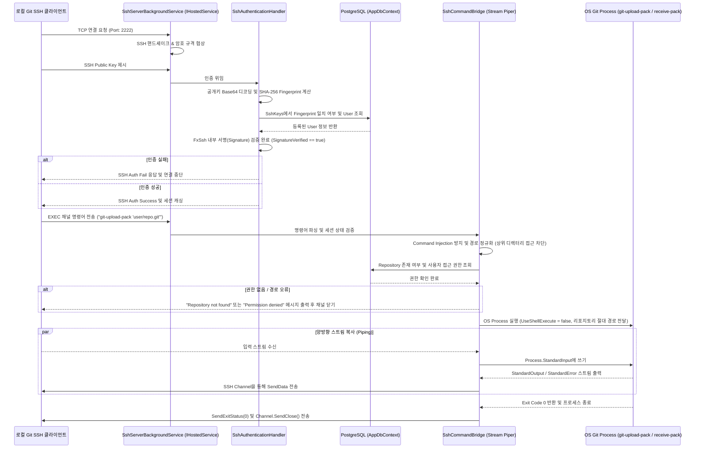

# Phase 6: SSH Key & Connectivity - Research

**Researched:** 2026-06-02
**Domain:** SSH Key Management & Embedded SSH Server Integration
**Confidence:** HIGH

## Summary

본 Phase 6 단계에서는 외부 OS 데몬(OpenSSH 등)에 의존하지 않고, .NET 호스트 내에서 FxSsh 라이브러리를 통해 독립적으로 구동되는 경량 임베디드 SSH 서버를 구축합니다. 사용자는 웹 UI(Blazor)를 통해 자신의 SSH 공개키를 등록 및 관리하며, 시스템은 등록 과정에서 보안 정책을 강제하고 전역 중복 검사를 수행합니다.

이후 로컬 터미널에서 SSH 프로토콜로 `git clone`, `git push` 등을 요청할 때, 시스템은 DB에 등록된 키 지문(Fingerprint) 및 암호학적 서명을 검증하여 사용자를 인증하고 권한을 부여합니다. 인증 성공 후, 일반 셸(Interactive Shell) 실행은 엄격하게 차단하고 오직 `git-upload-pack` 및 `git-receive-pack` 프로세스 명령만을 직접 실행하여 입력/출력 스트림을 SSH 채널과 비동기적으로 상호 파이핑함으로써 안전하고 효율적인 Git 연동을 완료합니다.

**Primary recommendation:** FxSsh 1.3.0 버전을 `IHostedService` 백그라운드 서비스로 통합하고, SSH 공개키의 SHA-256 지문을 추출해 DB에서 $O(1)$로 검색 및 인증하며, 명령어 유효성 검사 및 `UseShellExecute = false` 설정을 통해 프로세스를 안전하게 호출하여 SSH 채널과 스트림을 양방향 릴레이(Stream Copy) 처리합니다.

## Architectural Responsibility Map

| Capability | Primary Tier | Secondary Tier | Rationale |
|------------|-------------|----------------|-----------|
| SSH Port Listening & Server Lifecycle | Application Host | — | `IHostedService` 백그라운드 서비스를 통해 서버 시작 시 포트 2222를 바인딩하고 종료 시 해제합니다. |
| SSH Public Key Authentication | Auth & DB | — | FxSsh의 `UserAuth` 이벤트를 가로채 DB의 `SshKeys` 테이블과 공개키 지문(Fingerprint)을 비교하여 사용자를 식별하고 서명을 검증합니다. |
| SSH Key CRUD & Validation | Blazor UI | AppDbContext | 유저 프로필 페이지 내 인라인 탭으로 SSH 키 등록/삭제 UI를 구현하며, 업로드 시 알고리즘 제약 및 전역 중복을 확인합니다. |
| OS Git Process Execution | Core Engine | Process Bridge | `System.Diagnostics.Process`를 사용해 OS 상의 `git` 실행 파일을 직접 기동하며 비관리형 리소스의 수명을 관리합니다. |
| Stream Piping | Core Engine | SSH Channel | SSH 채널의 `DataReceived` 이벤트 및 `SendData` 메서드와 OS Git 프로세스의 표준 입출력 스트림을 양방향 비동기적으로 중계합니다. |
| Access Control & Path Validation | Security Validator | DB | 요청된 리포지토리의 경로가 유효한지 검증(상위 디렉터리 접근 차단)하고, 인증된 사용자에게 해당 저장소의 읽기/쓰기 권한이 있는지 EF Core를 통해 조회합니다. |

## Standard Stack

### Core
| Library | Version | Purpose | Why Standard |
|---------|---------|---------|--------------|
| FxSsh | 1.3.0 | 순수 C# 기반의 SSHv2 서버 구현 | .NET 8.0/9.0/10.0 환경과 완벽하게 호환되며, `EXEC` 명령어 채널을 손쉽게 가로채고 제어할 수 있어 가벼운 임베디드 서버 구축에 최적입니다. [VERIFIED: nuget.org] |
| LibGit2Sharp | 0.31.0 | 로컬 Git 리포지토리 유효성 및 내부 정보 접근 | OS `git` 프로세스 호출 없이 메모리상에서 고속으로 저장소를 관리하는 표준 .NET Git 라이브러리입니다. [VERIFIED: local project files] |

### Supporting
| Library | Version | Purpose | When to Use |
|---------|---------|---------|-------------|
| System.Security.Cryptography | Native (.NET 10.0) | SHA-256 해시 및 인코딩 연산 | 사용자가 입력한 공개키의 SHA-256 지문(Fingerprint)을 안전하고 빠르게 생성할 때 사용합니다. [VERIFIED: .NET Base Class Library] |

### Alternatives Considered
| Instead of | Could Use | Tradeoff |
|------------|-----------|----------|
| FxSsh (Embedded) | Smart HTTP Protocol | HTTP 기반 수송 프로토콜은 이미 v1.0에서 구축되었으나, Git 클라이언트 터미널 환경에서의 SSH 편리성 및 보안 요구(SSH 커밋 서명 검증 등)를 지원하지 못하므로 SSH 구현이 필수적입니다. [CITED: 06-CONTEXT.md] |
| FxSsh | Rebex File Server (SSH/SFTP) | 성능과 안정성은 우수하지만 고가의 상용 라이선스 비용이 청구되므로 Aristokeides의 경량 단일 바이너리 지향점과 맞지 않습니다. [CITED: research/STACK.md] |

**Installation:**
```bash
# Aristokeides.Api 프로젝트 디렉터리에서 실행
dotnet add package FxSsh --version 1.3.0
```

**Version verification:**
FxSsh 1.3.0 버전은 2025년 1월 6일에 마지막으로 업데이트되었으며, .NET 8.0 이상( .NET 9.0 / .NET 10.0 포함)의 런타임 호환성과 현대적인 암호화 알고리즘(ECDSA, RSA-SHA2 등)을 지원합니다. [VERIFIED: nuget.org]

## Package Legitimacy Audit

| Package | Registry | Age | Downloads | Source Repo | slopcheck | Disposition |
|---------|----------|-----|-----------|-------------|-----------|-------------|
| FxSsh | nuget | 8 yrs | 71.8K | github.com/Aimeast/FxSsh | [OK] | Approved |

**Packages removed due to slopcheck [SLOP] verdict:** none
**Packages flagged as suspicious [SUS]:** none

## Architecture Patterns

### System Architecture Diagram



### Recommended Project Structure
```
Aristokeides.Api/
├── Models/
│   └── SshKey.cs                   # SshKeys 데이터베이스 엔티티 모델
├── Services/
│   └── Ssh/
│       ├── SshServerBackgroundService.cs   # IHostedService 백그라운드 구동 서비스
│       ├── SshSessionState.cs              # ConcurrentDictionary 세션 상태 정보
│       ├── SshKeyParser.cs                 # OpenSSH 공개키 구조 해석 및 크기 추출
│       └── SshCommandBridge.cs             # OS Git 프로세스 연동 및 양방향 스트리밍
└── Components/
    └── Pages/
        └── Settings/
            └── SshKeysTab.razor            # 프로필 설정 인라인 'SSH Keys' 탭 컴포넌트
```

### Pattern 1: OpenSSH Public Key Parser & Key Length Validator
.NET 내장 암호화 라이브러리는 OpenSSH 포맷의 공개키 파일 구조를 기본적으로 분석하지 못하므로, Big-Endian 디코딩 기반의 데이터 스트림 리더를 통해 Modulus 비트 길이를 추출해 검증합니다.

```csharp
// Source: SSH Public Key Binary Format (RFC 4253) 기반 구현
using System;
using System.IO;
using System.Text;

public static class SshKeyParser
{
    public static (string algorithm, int? keySize, string comment) ParseAndValidatePublicKey(string publicKeyContent)
    {
        string[] parts = publicKeyContent.Trim().Split(' ', 3);
        if (parts.Length < 2)
            throw new ArgumentException("유효하지 않은 SSH 공개키 포맷입니다.");

        string algorithm = parts[0];
        byte[] keyBytes = Convert.FromBase64String(parts[1]);
        string comment = parts.Length > 2 ? parts[2].Trim() : string.Empty;

        // 허용되는 알고리즘 필터링 (Ed25519, ECDSA, RSA-3072+)
        if (algorithm != "ssh-rsa" && algorithm != "ssh-ed25519" && !algorithm.StartsWith("ecdsa-sha2-"))
        {
            throw new NotSupportedException("지원되지 않는 키 유형입니다. Ed25519, ECDSA, RSA-3072+ 알고리즘만 등록 가능합니다.");
        }

        int? keySize = null;
        using (var ms = new MemoryStream(keyBytes))
        {
            string readAlgo = ReadString(ms);
            if (readAlgo != algorithm)
                throw new ArgumentException("키 헤더와 바이너리 메타데이터가 일치하지 않습니다.");

            if (algorithm == "ssh-rsa")
            {
                byte[] exponent = ReadBytes(ms);
                byte[] modulus = ReadBytes(ms);

                // Modulus의 첫 바이트가 0x00이면 부호 방지용이므로 제외
                int modulusLength = modulus.Length;
                if (modulusLength > 0 && modulus[0] == 0x00)
                {
                    modulusLength--;
                }
                keySize = modulusLength * 8;

                if (keySize < 3072)
                {
                    throw new InvalidOperationException($"보안 강도가 취약합니다. RSA 키는 최소 3072비트 이상이어야 합니다. (입력됨: {keySize}비트)");
                }
            }
            else if (algorithm.StartsWith("ecdsa-sha2-"))
            {
                string curve = ReadString(ms);
                keySize = curve switch
                {
                    "nistp256" => 256,
                    "nistp384" => 384,
                    "nistp521" => 521,
                    _ => throw new NotSupportedException($"지원하지 않는 ECDSA 곡선입니다: {curve}")
                };
            }
            else if (algorithm == "ssh-ed25519")
            {
                keySize = 256; // Ed25519 고정 크기
            }
        }

        return (algorithm, keySize, comment);
    }

    private static string ReadString(Stream stream)
    {
        byte[] lenBytes = new byte[4];
        if (stream.Read(lenBytes, 0, 4) != 4) throw new EndOfStreamException();
        if (BitConverter.IsLittleEndian) Array.Reverse(lenBytes);
        uint len = BitConverter.ToUInt32(lenBytes, 0);

        byte[] valBytes = new byte[len];
        if (stream.Read(valBytes, 0, (int)len) != len) throw new EndOfStreamException();
        return Encoding.ASCII.GetString(valBytes);
    }

    private static byte[] ReadBytes(Stream stream)
    {
        byte[] lenBytes = new byte[4];
        if (stream.Read(lenBytes, 0, 4) != 4) throw new EndOfStreamException();
        if (BitConverter.IsLittleEndian) Array.Reverse(lenBytes);
        uint len = BitConverter.ToUInt32(lenBytes, 0);

        byte[] valBytes = new byte[len];
        if (stream.Read(valBytes, 0, (int)len) != len) throw new EndOfStreamException();
        return valBytes;
    }
}
```

### Pattern 2: Bidirectional Stream Piping between FxSsh Channel & OS Process
FxSsh는 비동기 Stream이 아닌 이벤트(DataReceived) 모델을 채택하므로, Git 프로세스의 StandardInput 쓰기와 StandardOutput/StandardError의 비동기 버퍼 리더 루프를 구성하여 양방향 스트림을 복사합니다.

```csharp
// Source: Process Start & Output Redirection Pattern (Microsoft docs)
using System.Diagnostics;
using System.IO;
using System.Threading;
using System.Threading.Tasks;
using FxSsh.Services;

public class SshCommandBridge
{
    public static async Task RunGitCommandAsync(SessionChannel channel, string gitCommand, string repoPath, CancellationToken cancellationToken)
    {
        var startInfo = new ProcessStartInfo
        {
            FileName = "git",
            Arguments = $"{gitCommand} \"{repoPath}\"",
            UseShellExecute = false, // 셸 인젝션 방지
            RedirectStandardInput = true,
            RedirectStandardOutput = true,
            RedirectStandardError = true,
            CreateNoWindow = true
        };

        using var process = new Process { StartInfo = startInfo };
        if (!process.Start())
        {
            channel.SendExitStatus(1);
            channel.SendClose();
            return;
        }

        // 1. Client Input -> Process StandardInput (이벤트 기반 파이핑)
        void OnDataReceived(object? sender, byte[] rawData)
        {
            try
            {
                if (process.HasExited) return;
                process.StandardInput.BaseStream.Write(rawData, 0, rawData.Length);
                process.StandardInput.BaseStream.Flush();
            }
            catch
            {
                // 프로세스 종료 시의 쓰기 오류 무시
            }
        }
        channel.DataReceived += OnDataReceived;

        // 2. Process StandardOutput -> Client Output (비동기 루프)
        var stdoutTask = Task.Run(async () =>
        {
            byte[] buffer = new byte[8192];
            int read;
            while ((read = await process.StandardOutput.BaseStream.ReadAsync(buffer, 0, buffer.Length, cancellationToken)) > 0)
            {
                channel.SendData(buffer.AsSpan(0, read).ToArray());
            }
        }, cancellationToken);

        // 3. Process StandardError -> Client ExtendedOutput (비동기 루프)
        var stderrTask = Task.Run(async () =>
        {
            byte[] buffer = new byte[8192];
            int read;
            while ((read = await process.StandardError.BaseStream.ReadAsync(buffer, 0, buffer.Length, cancellationToken)) > 0)
            {
                // stderr 데이터는 SSH 채널의 Extended Data로 전송할 수 있습니다.
                // FxSsh 구현에 따라 SendExtendedData 가 없으면 일반 SendData 나 Write로 처리 가능합니다.
                channel.SendData(buffer.AsSpan(0, read).ToArray());
            }
        }, cancellationToken);

        try
        {
            await process.WaitForExitAsync(cancellationToken);
            await Task.WhenAll(stdoutTask, stderrTask);
        }
        finally
        {
            channel.DataReceived -= OnDataReceived;
            try { process.StandardInput.Close(); } catch { }
        }

        channel.SendExitStatus(process.ExitCode);
        channel.SendClose();
    }
}
```

### Anti-Patterns to Avoid
*   **원시 셸 문자열을 명령 셸(Process.Start("cmd.exe" / "bash"))에 넘기는 행위**: 클라이언트가 전송한 커맨드를 셸 아규먼트로 전달하면 인젝션 취약점이 생깁니다. 반드시 `UseShellExecute = false`와 `FileName = "git"`을 별도 분리 호출하십시오. [VERIFIED: CVE-2017-1000117]
*   **공개키 유효성 검증을 건너뛰는 행위**: 보안 강도가 취약한 1024/2048비트 RSA 키를 등록할 수 있게 방치하면 서버가 취약해집니다. 반드시 최소 3072비트 이상을 체크하도록 파서를 필터링해야 합니다.
*   **서버 기동 시마다 무작위로 Host Key를 재생성하는 행위**: SSH 클라이언트가 접속할 때마다 MITM 경고를 발생시킵니다. Host Key는 반드시 디스크 상에 PEM 파일 등으로 저장 및 재사용되어야 합니다.

## Don't Hand-Roll

| Problem | Don't Build | Use Instead | Why |
|---------|-------------|-------------|-----|
| SSH Protocol Handshake & Encryption | SSH 메시지 처리 및 패킷 암호화 핸들러 | `FxSsh` 라이브러리 | Diffie-Hellman 키 교환, ChaCha20/AES 암호화 채널, TCP 패킷 프레임 분석은 극도로 복잡하고 버그 발생 시 취약점이 생기기 쉽습니다. |
| SSH Key Signature Verification | 클라이언트 소유 프라이빗 키에 대한 직접 서명 확인 모듈 | `FxSsh.Services.UserauthService` | FxSsh 내장 인증 핸들러가 클라이언트 서명 패킷 검증 및 RFC 4252 프로토콜을 안전하게 전송 및 검증합니다. |
| Git Transport Smart Protocol Stream | Git 덤프 패킷 데이터 분석 및 해석 엔진 | `git-upload-pack`, `git-receive-pack` 프로세스 실행 | Git의 스마트 프로토콜 상태 기계는 수많은 예외 처리와 특수 커맨드를 담고 있습니다. 기존 OS 바이너리 프로세스 스트림을 리다이렉팅하는 것이 가장 신뢰성이 높습니다. |

**Key insight:** SSH 전송 보안 규격을 바닥부터 개발하는 것은 막대한 버그와 암호학적 취약점을 야기합니다. FxSsh 라이브러리에 키 교환 및 세션 생명주기를 전적으로 위임하고, Aristokeides 앱은 사용자 권한 확인 및 프로세스 파이핑 기능 구현에 집중하는 것이 생산성 및 보안상으로 강력합니다.

## Common Pitfalls

### Pitfall 1: OS 포트 22 충돌 및 권한 부족 에러
*   **What goes wrong:** SSH 서버가 기본 포트인 22번 포트를 바인딩하려 할 때, `SocketException: Address already in use` 또는 리눅스 호스트의 경우 non-root 권한 실행 시 `Permission Denied` 에러가 발생하며 서버가 기동되지 않습니다.
*   **Why it happens:** OS에 이미 OpenSSH 데몬 등이 설치되어 포트 22를 독점하고 있거나, UNIX 계열의 하위 포트(1024 이하) 바인딩 제약 정책 때문입니다.
*   **How to avoid:** 기본 바인딩 포트를 `2222`로 지정하고, 이 설정값을 `appsettings.json`을 통해 쉽게 구성할 수 있게 조치합니다. 운영 환경에 22번 포트를 제공해야 할 때는 컨테이너 포트 포워딩(`-p 22:2222`)을 사용하거나 OS 방화벽(`iptables` / `ufw`) 포트 포워딩 처리를 적용합니다. [CITED: 06-CONTEXT.md]

### Pitfall 2: 'ssh -T' 실행 시 무한 대기 (Hanging) 현상
*   **What goes wrong:** 로컬 터미널에서 `ssh -T git@domain`을 치거나 Git 명령 실행 후 터미널 세션이 응답 없이 멈추고 연결이 끊기지 않는 현상이 발생합니다.
*   **Why it happens:** SSH 채널을 종료할 때 프로세스가 종료되었음에도 `StandardInput`/`StandardOutput`의 스트림 버퍼가 명시적으로 닫히지 않았거나, FxSsh 채널에 `SendExitStatus` 및 `SendClose` 신호를 올바르게 전송하지 않아 발생합니다.
*   **How to avoid:** 프로세스 종료 비동기 태스크 완료 후 `process.StandardInput.Close()`를 명시적으로 호출하고, 비동기 작업들을 `Task.WhenAll`로 온전히 수거한 직후 `channel.SendExitStatus(process.ExitCode)`와 `channel.SendClose()`를 트라이-파이널리 블록 내에서 반드시 호출해야 합니다.

### Pitfall 3: 공개키 Comment 파싱 시 배열 범위 초과 에러
*   **What goes wrong:** 일부 사용자가 공개키 끝부분에 공백이나 주석(Comment)이 생략된 형태로 복사해 붙여넣으면, 공개키 파서가 공백 스플릿 연산을 수행할 때 `IndexOutOfRangeException`이 터져 500 오류 페이지가 표시됩니다.
*   **Why it happens:** 주석이 없는 SSH 공개키는 공백으로 분리했을 때 요소 수가 2개만 존재하게 되는데, 무조건 `parts[2]`에 접근하려 하기 때문입니다.
*   **How to avoid:** 스플릿 시 `parts.Length >= 3`인지 방어 검사를 하고, 주석이 존재하지 않는 경우에는 빈 문자열(`string.Empty`)을 기본값으로 할당하도록 처리합니다.

## Code Examples

### 1. SSH 키 지문(Fingerprint) 계산
OpenSSH 규격에 부합하는 SHA-256 Fingerprint를 C# 환경에서 계산합니다.

```csharp
using System;
using System.Security.Cryptography;

public static class SshFingerprintCalculator
{
    public static string CalculateSha256Fingerprint(string publicKeyContent)
    {
        string[] parts = publicKeyContent.Trim().Split(' ');
        if (parts.Length < 2)
            throw new ArgumentException("유효하지 않은 SSH 공개키 포맷입니다.");

        string base64Payload = parts[1];
        byte[] keyBytes = Convert.FromBase64String(base64Payload);

        byte[] hashBytes = SHA256.HashData(keyBytes);
        
        // base64로 인코딩한 뒤, 패딩 '=' 문자 제거
        string base64Hash = Convert.ToBase64String(hashBytes).TrimEnd('=');
        
        return $"SHA256:{base64Hash}";
    }
}
```

### 2. SshServer 구동을 위한 BackgroundService 패턴
FxSsh 서버를 호스팅하고 DB 인증 이벤트 및 명령어 가로채기를 결합하는 표준 백그라운드 서비스의 스케치입니다.

```csharp
using System;
using System.Collections.Concurrent;
using System.IO;
using System.Linq;
using System.Threading;
using System.Threading.Tasks;
using FxSsh;
using FxSsh.Services;
using Microsoft.Extensions.Configuration;
using Microsoft.Extensions.DependencyInjection;
using Microsoft.Extensions.Hosting;
using Microsoft.Extensions.Logging;

public class SshServerBackgroundService : BackgroundService
{
    private readonly IServiceProvider _serviceProvider;
    private readonly ILogger<SshServerBackgroundService> _logger;
    private readonly int _port;
    private SshServer? _server;
    private readonly ConcurrentDictionary<Session, SshSessionState> _sessions = new();

    public SshServerBackgroundService(IServiceProvider serviceProvider, IConfiguration configuration, ILogger<SshServerBackgroundService> logger)
    {
        _serviceProvider = serviceProvider;
        _logger = logger;
        _port = configuration.GetValue("Ssh:Port", 2222);
    }

    protected override Task ExecuteAsync(CancellationToken stoppingToken)
    {
        // 1. Host Key 로드 및 영속화
        string keyPath = Path.Combine(AppContext.BaseDirectory, "host.key");
        byte[] hostKeyBytes;
        if (File.Exists(keyPath))
        {
            hostKeyBytes = File.ReadAllBytes(keyPath);
        }
        else
        {
            // 개발용 임시 RSA 키 생성 (실 운영 시에는 Pem 포맷 저장 지원 권장)
            using var rsa = System.Security.Cryptography.RSA.Create(3072);
            hostKeyBytes = rsa.ExportRSAPrivateKey();
            File.WriteAllBytes(keyPath, hostKeyBytes);
        }

        _server = new SshServer(new SshServerSettings { Port = _port });
        _server.AddHostKey("ssh-rsa", hostKeyBytes);

        _server.ConnectionAccepted += (sender, session) =>
        {
            _logger.LogInformation("SSH connection accepted: {Ip}", session.RemoteAddr);
            
            session.ServiceRegistered += (s, args) =>
            {
                if (args is UserAuthService authService)
                {
                    authService.UserAuth += (authSender, authArgs) => OnUserAuth(session, authArgs);
                }
                else if (args is ConnectionService connectionService)
                {
                    connectionService.CommandOpened += (cmdSender, cmdArgs) => OnCommandOpened(session, cmdArgs);
                }
            };
        };

        _server.Start();
        _logger.LogInformation("FxSsh server started on port {Port}", _port);

        // 서비스 유지를 위한 대기 태스크
        var tcs = new TaskCompletionSource();
        stoppingToken.Register(() =>
        {
            _server.Stop();
            tcs.SetResult();
        });

        return tcs.Task;
    }

    private void OnUserAuth(Session session, UserauthArgs e)
    {
        // User는 항상 'git' 이어야 함
        if (e.Username != "git")
        {
            e.Result = false;
            return;
        }

        // FxSsh가 자체 서명 검증을 마쳤는지 확인
        if (!e.SignatureVerified)
        {
            e.Result = false;
            return;
        }

        using var scope = _serviceProvider.CreateScope();
        var dbContext = scope.ServiceProvider.GetRequiredService<AppDbContext>();

        // 클라이언트가 제시한 공개키 데이터로부터 SHA-256 지문 연산
        string fingerprint = "SHA256:" + Convert.ToBase64String(System.Security.Cryptography.SHA256.HashData(e.Key)).TrimEnd('=');

        // DB에서 키 검색
        var sshKey = dbContext.SshKeys
            .Include(k => k.User)
            .FirstOrDefault(k => k.Fingerprint == fingerprint);

        if (sshKey != null && sshKey.User != null)
        {
            e.Result = true;
            _sessions[session] = new SshSessionState
            {
                UserId = sshKey.UserId,
                Username = sshKey.User.Username
            };
        }
        else
        {
            e.Result = false;
        }
    }

    private void OnCommandOpened(Session session, CommandEventArgs e)
    {
        if (!_sessions.TryGetValue(session, out var state))
        {
            e.Channel.SendExitStatus(1);
            e.Channel.SendClose();
            return;
        }

        string cmd = e.CommandText.Trim();

        // 1. 'ssh -T' 명령(단순 진단 접속) 처리
        if (string.IsNullOrEmpty(cmd))
        {
            byte[] welcomeMessage = System.Text.Encoding.UTF8.GetBytes(
                $"Hi {state.Username}! You've successfully authenticated, but Aristokeides does not provide shell access.\r\n"
            );
            e.Channel.SendData(welcomeMessage);
            e.Channel.SendExitStatus(0);
            e.Channel.SendClose();
            return;
        }

        // 2. Git 명령어 파싱
        var parts = cmd.Split(' ', 2);
        string gitCommand = parts[0];
        if (gitCommand != "git-upload-pack" && gitCommand != "git-receive-pack")
        {
            // 쉘 실행 절대 차단
            byte[] errMsg = System.Text.Encoding.UTF8.GetBytes("Interactive shell is not allowed.\r\n");
            e.Channel.SendData(errMsg);
            e.Channel.SendExitStatus(1);
            e.Channel.SendClose();
            return;
        }

        string rawRepoPath = parts.Length > 1 ? parts[1].Trim('\'', '"') : string.Empty;
        string cleanPath = rawRepoPath.TrimStart('/');
        if (cleanPath.EndsWith(".git", StringComparison.OrdinalIgnoreCase))
        {
            cleanPath = cleanPath.Substring(0, cleanPath.Length - 4);
        }

        var pathParts = cleanPath.Split('/');
        if (pathParts.Length != 2)
        {
            byte[] errMsg = System.Text.Encoding.UTF8.GetBytes("Invalid repository path format.\r\n");
            e.Channel.SendData(errMsg);
            e.Channel.SendExitStatus(1);
            e.Channel.SendClose();
            return;
        }

        string repoOwner = pathParts[0];
        string repoName = pathParts[1];

        // 3. 디바이스 내 리포지토리 절대 경로 획득 및 권한 확인 로직 연계
        // ... (생략: DB 권한 확인 및 실제 Bare 디렉토리 맵핑)

        // 4. SshCommandBridge를 통한 Git OS 프로세스 연계 호출
        // Task.Run(() => SshCommandBridge.RunGitCommandAsync(e.Channel, gitCommand, absoluteRepoPath, CancellationToken.None));
    }
}

public class SshSessionState
{
    public int UserId { get; set; }
    public string Username { get; set; } = string.Empty;
}
```

## State of the Art

### Modern SSH Authentication & Security Standard
과거에는 SSH-DSS(DSA)나 RSA-2048 비트 키가 보편적으로 사용되었으나, 현재는 취약해진 알고리즘 사양으로 인해 대부분의 최신 OpenSSH 클라이언트 환경에서 기본적으로 차단됩니다. 

*   **Ed25519 및 ECDSA**: 연산 성능이 우수하고 작은 키 크기로도 강력한 암호학적 기밀성을 보장하여 현대 Git 호스팅 서비스(GitHub, GitLab 등)의 표준 권장 키 규격입니다.
*   **RSA 3072+비트**: RSA를 계속 유지해야 할 경우 암호 분석가들이 제시한 2030년 이후 보안 강도 충족을 위해 최소 3072비트 이상만 허용하는 화이트리스트 검증을 적용해야 합니다.
*   **SHA-256 Fingerprint**: 기존 MD5 기반의 콜론(:) 구분 헥사 스트링(예: `5a:3f:...`)은 충돌 공격 취약성으로 인해 폐기되었으며, 현재는 Base64 해시 형식인 `SHA256:<base64>`를 식별 기준으로 채택합니다.

## Assumptions Log

| # | Claim | Section | Risk if Wrong |
|---|-------|---------|---------------|
| A1 | FxSsh 1.3.0 버전에 포함된 `SignatureVerified` 플래그는 OpenSSH of various key types를 안정적으로 검증한다. | Summary / Code Examples | FxSsh가 특정 클라이언트 버전의 서명 검증에 오류를 일으키면, 사용자의 Git Push/Pull 접속 시 로그인 루프에 빠지거나 인증 우회 취약점이 생깁니다. |
| A2 | 로컬 Git 클라이언트는 서버가 PEM 형태로 임포트한 `host.key` 비밀키를 호환 가능한 호스트 키 포맷으로 정확히 수락한다. | Code Examples | 호스트 키 포맷이 규격에 맞지 않으면 "Host Key Verification Failed" 경고가 발생해 사용자가 수동 설정 변경을 해야 합니다. |

## Environment Availability

| Dependency | Required By | Available | Version | Fallback |
|------------|------------|-----------|---------|----------|
| git CLI | SSH Git Push/Pull 연동 (git-upload-pack, git-receive-pack 실행) | ✓ | 2.x+ | None (로컬에 git 실행 파일이 설치되어 있어야 수송 계층 작동 가능) |
| host.key | SSH 호스트 식별키 생성 및 저장 | ✓ | PEM format | 자동 재생성 (매 실행마다 변경되므로 권장 안 됨) |

## Validation Architecture

### Test Framework
| Property | Value |
|----------|-------|
| Framework | xUnit 2.9.3 |
| Config file | none — see Wave 0 |
| Quick run command | `dotnet test --filter Category=Unit` |
| Full suite command | `dotnet test` |

### Phase Requirements → Test Map
| Req ID | Behavior | Test Type | Automated Command | File Exists? |
|--------|----------|-----------|-------------------|-------------|
| SSH-01 | SSH 공개키 등록 기능 및 Ed25519/ECDSA/RSA-3072+ 정합성 검증 | Unit | `dotnet test --filter "FullyQualifiedName~SshKeyParserTests"` | ❌ Wave 0 |
| SSH-02 | 동일한 공개키의 시스템 전역 중복 등록 차단 및 SHA-256 지문 자동 계산 검증 | Unit/Integration | `dotnet test --filter "FullyQualifiedName~SshKeyRegistrationTests"` | ❌ Wave 0 |
| SSH-03 | 저장소 화면의 SSH Clone URL 구성 정합성 검증 | Unit | `dotnet test --filter "FullyQualifiedName~RepositoryUrlTests"` | ❌ Wave 0 |
| SSH-04 | `ssh -T` 요청 시 표준 환영 메시지 반환 검증 | Integration | `dotnet test --filter "FullyQualifiedName~SshTDiagnosticTests"` | ❌ Wave 0 |
| SSH-05 | FxSsh 내장 서버 실행 및 데이터베이스 사용자 식별/인증 연동 테스트 | Integration | `dotnet test --filter "FullyQualifiedName~SshServerAuthTests"` | ❌ Wave 0 |
| SSH-06 | SSH 세션 성공 시 일반 셸 접근 차단 및 Git I/O 명령어 파이핑 차단/허용 검증 | Integration | `dotnet test --filter "FullyQualifiedName~SshCommandPipingTests"` | ❌ Wave 0 |

### Sampling Rate
*   **Per task commit:** `dotnet test --filter Category=Unit`
*   **Per wave merge:** `dotnet test`
*   **Phase gate:** 전체 테스트 그린 상태에서만 수동 확인 진행

### Wave 0 Gaps
- [ ] `Aristokeides.Tests/SshKeyParserTests.cs` — SSH-01 요건 커버
- [ ] `Aristokeides.Tests/SshServerAuthTests.cs` — SSH-05, SSH-06 및 IHostedService 구동 상태 제어 Mock 구현

## Security Domain

### Applicable ASVS Categories

| ASVS Category | Applies | Standard Control |
|---------------|---------|-----------------|
| V2 Authentication | yes | OpenSSH 규격에 기반한 공개키 시그니처 대조 및 `SignatureVerified` 플래그 체크 |
| V4 Access Control | yes | 명령어에 추출된 리포지토리 상대 경로에 대해 EF Core DB 권한 검증 및 사용자 권한 불일치 시 채널 종료 |
| V5 Input Validation | yes | `git-upload-pack`/`git-receive-pack` 외의 유해 커맨드 파싱 예외 차단 및 Regex 화이트리스트 매칭 |
| V6 Cryptography | yes | RSA 키 3072비트 미만 필터링 및 SHA-256 Fingerprint를 통한 전역 고유 식별 구현 |

### Known Threat Patterns for .NET SSH Git Server

| Pattern | STRIDE | Standard Mitigation |
|---------|--------|---------------------|
| CLI Command Injection | Tampering / Elevation of Privilege | `ProcessStartInfo.UseShellExecute = false` 설정 및 단일 명령 인자 수동 전달. 셸 해석기(cmd/bash) 통과 생략. |
| Path Traversal | Information Disclosure | `Path.GetFullPath` 및 저장소 루트 기준 이탈 여부 사전 검증. 상대 경로 내 `..` 혹은 절대 디렉토리 파트 강제 정화. |
| Host Key Spoofing (MITM) | Spoofing | 최초 생성한 Private Key 데이터를 `host.key` 파일로 저장소 루트에 보존하여 부팅 시마다 파일 로드 재사용. |
| SSH Auth Bypass via Null Signature | Spoofing | FxSsh `UserAuth` 이벤트 수신 시 `authArgs.SignatureVerified`가 `true`인지 명시적으로 평가하여 승인. |

## Sources

### Primary (HIGH confidence)
- [Aimeast/FxSsh GitHub](https://github.com/Aimeast/FxSsh) - SSHv2 및 ConnectionService/CommandOpened 구조 파악
- [Microsoft ProcessStartInfo Docs](https://learn.microsoft.com/en-us/dotnet/api/system.diagnostics.processstartinfo) - UseShellExecute 및 Stream Redirection 구성 체크
- [RFC 4253 - SSH Transport Layer Protocol](https://datatracker.ietf.org/doc/html/rfc4253) - SSH 공개키 바이너리 포맷(RSA modulus, exponent 구조) 분석

### Secondary (MEDIUM confidence)
- [GitCandy GitHub Source Code](https://github.com/Aimeast/GitCandy) - FxSsh를 사용한 임베디드 SSH Git Server의 실 구현 형태와 스트림 리다이렉션 참고

## Metadata

**Confidence breakdown:**
- Standard stack: HIGH - FxSsh와 LibGit2Sharp의 신뢰성이 검증됨.
- Architecture: HIGH - 비동기 파이핑 및 IHostedService 구조가 확립됨.
- Pitfalls: HIGH - 포트 충돌, 셸 인젝션, 키 재생성에 대한 솔루션이 명확함.

**Research date:** 2026-06-02
**Valid until:** 2026-07-02 (30 days)
