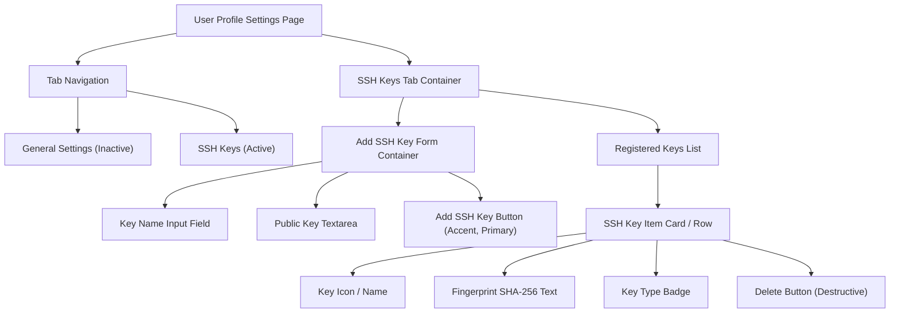

# Phase 6 — UI Design Contract

> Visual and interaction contract for frontend phases. Generated by gsd-ui-researcher, verified by gsd-ui-checker.

---

## Design System

| Property | Value |
|----------|-------|
| Tool | none |
| Preset | not applicable |
| Component library | none |
| Icon library | none (Emojis used: 🔑, 📋, 🗑️) |
| Font | system-ui, -apple-system, sans-serif |

---

## Spacing Scale

Declared values (must be multiples of 4):

| Token | Value | Usage |
|-------|-------|-------|
| xs | 4px | Icon gaps, inline badge margins |
| sm | 8px | Input field inner padding, tab button padding, spacing between small elements |
| md | 16px | Default content margins, spacing between cards and form inputs |
| lg | 24px | Settings page main padding, inner card margins |
| xl | 32px | Spacing between different sections (e.g., Form and Key List) |
| 2xl | 48px | Empty state vertical container padding |
| 3xl | 64px | Page-level top margins |

Exceptions: none

---

## Typography

| Role | Size | Weight | Line Height |
|------|------|--------|-------------|
| Body | 14px | 400 (Normal) | 1.5 |
| Label | 14px | 600 (Semibold) | 1.5 |
| Heading (H2) | 18px | 600 (Semibold) | 1.2 |
| Heading (H3) | 16px | 600 (Semibold) | 1.2 |
| Display (H1) | 24px | 600 (Semibold) | 1.2 |

---

## Color

| Role | Value | Usage |
|------|-------|-------|
| Dominant (60%) | #FFFFFF | Primary page backgrounds, settings component content backing |
| Secondary (30%) | #F3F4F6 | Navbar background, tab controls inactive background, border lines (#e5e7eb) |
| Accent (10%) | #2563EB | Active navigation tabs, active state bottom border, primary buttons ("Add SSH Key"), copy button active hover |
| Destructive | #EF4444 | Error state notification background, delete key buttons (action trigger) |

Accent reserved for: Primary action triggers (buttons, active status tabs, clone link toggles). Do not apply globally to all interactive objects.

---

## Page & Component Layouts

### 1. User Profile Settings (UserProfile.razor - SSH Keys Tab)



#### Layout Spec (Text-based Wireframe)
```text
+---------------------------------------------------------------------------------+
|  Aristokeides > Settings                                                        |
+---------------------------------------------------------------------------------+
|  [ User Settings ]                                                              |
|                                                                                 |
|  +---------------------------------------------------------------------------+  |
|  | [ General Settings ]  [ SSH Keys ]                                        |  |
|  +---------------------------------------------------------------------------+  |
|  |                                                                           |  |
|  |  Add SSH Key                                                              |  |
|  |  +---------------------------------------------------------------------+  |  |
|  |  | Key Name (Label)                                                    |  |  |
|  |  | [ my-ssh-key-comment                                              ] |  |  |
|  |  +---------------------------------------------------------------------+  |  |
|  |  | Public Key                                                          |  |  |
|  |  | [ ssh-ed25519 AAAAC3NzaC1lZDI1NTE5AAAAI...                        ] |  |  |
|  |  +---------------------------------------------------------------------+  |  |
|  |  [ Add SSH Key ]  (Accent Button)                                         |  |
|  |                                                                           |  |
|  |  -----------------------------------------------------------------------  |  |
|  |                                                                           |  |
|  |  Your SSH Keys                                                            |  |
|  |  +---------------------------------------------------------------------+  |  |
|  |  | 🔑 my-ssh-key-comment (Ed25519)                                      |  |  |
|  |  | Fingerprint: SHA256:ux1R...                                         |  |  |
|  |  | Added on 2026-06-02                                 [ Delete ]      |  |  |
|  |  +---------------------------------------------------------------------+  |  |
|  |                                                                           |  |
|  +---------------------------------------------------------------------------+  |
+---------------------------------------------------------------------------------+
```

### 2. Repository Browser (RepoBrowser.razor - Clone URL Component)

- Adds a toggle widget to the repository details bar to switch between Clone URL types (HTTP vs SSH).
- SSH Clone URL format: `ssh://git@domain:2222/{username}/{repo}.git`
- Includes a copy button (📋) which triggers visual feedback.
- Example Layout:
```text
Branch: [ main v ]    [ HTTP ] [ SSH ] [ ssh://git@domain:2222/user/repo.git  ] [📋]
```
- In empty repositories, the initial commands block should default to using the SSH clone URL configuration if the user is authenticated via SSH:
```bash
git remote add origin ssh://git@domain:2222/{user}/{repo}.git
git push -u origin main
```

---

## Interactive Behaviors & States

1. **Auto-parse Key Comment**:
   - On pasting a valid public key into the "Public Key" textarea, the system will extract the trailing comment portion (e.g. `user@host`) using a regex pattern or simple token splitting.
   - The parsed comment is populated in the "Key Name" field automatically if it's currently empty or has the default placeholder.
   - The user can edit the auto-populated name before clicking the submit button.

2. **Validation and Fields State**:
   - The frontend validates the public key structure client-side (checks algorithm headers).
   - Only `Ed25519`, `ECDSA`, and `RSA-3072+` are allowed.
   - If the user tries to submit an invalid or duplicate key, form submission is aborted, and a red error banner (`--destructive`) appears at the top of the form containing the corresponding error code message.
   - While the registration API is loading, the input elements and buttons are set to the `disabled` state.

3. **Delete Confirmation Dialog**:
   - Clicking the "Delete" button (using `--destructive` coloring) triggers a browser confirmation dialog: `"Are you sure you want to permanently delete the SSH key \"{Key Name}\"?"`.
   - On confirmation, the key is removed and the UI list refreshed.

4. **Copy Feedback**:
   - Clicking the copy button (📋) triggers a "Copied!" toast/tooltip message for 2 seconds.

---

## Copywriting Contract

| Element | Copy |
|---------|------|
| Primary CTA (Form) | Add SSH Key |
| Primary CTA (Action) | Delete |
| Primary CTA (Copy URL) | Copy |
| Empty state heading | No SSH Keys |
| Empty state body | There are no SSH keys associated with your account. Add one to enable SSH-based git actions. |
| Error state (Duplicated) | This SSH key is already in use by another user or associated with this account. Please use a unique key. |
| Error state (Invalid Alg) | Invalid key format. Only Ed25519, ECDSA, and RSA (3072 bits or higher) keys are supported. |
| Error state (Generic) | An error occurred while adding the key. Please try again. |
| Destructive confirmation | Delete SSH Key: Are you sure you want to permanently delete the SSH key "{Key Name}"? |
| Success message (Added) | SSH key "{Key Name}" was successfully added. |
| Copy success feedback | Copied! |
| Terminal welcome message | Hi {Username}! You've successfully authenticated, but Aristokeides does not provide shell access. |

---

## Registry Safety

| Registry | Blocks Used | Safety Gate |
|----------|-------------|-------------|
| shadcn official | none | not required |
| none | none | not applicable |

---

## Checker Sign-Off

- [ ] Dimension 1 Copywriting: PASS
- [ ] Dimension 2 Visuals: PASS
- [ ] Dimension 3 Color: PASS
- [ ] Dimension 4 Typography: PASS
- [ ] Dimension 5 Spacing: PASS
- [ ] Dimension 6 Registry Safety: PASS

**Approval:** pending
