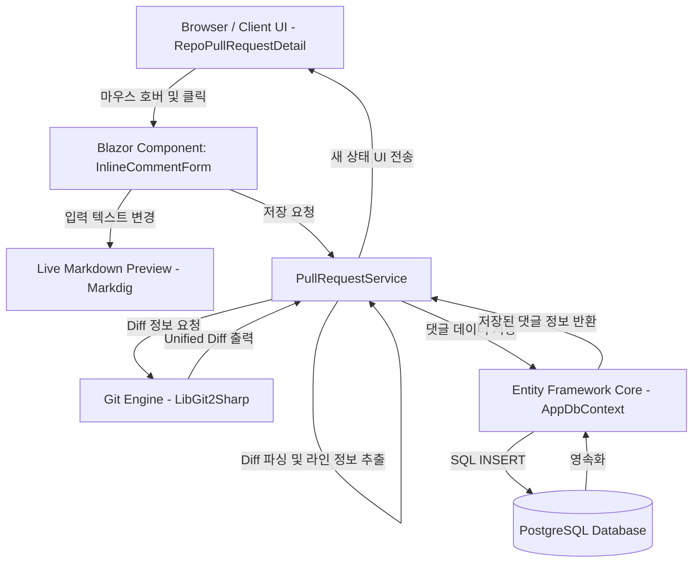

# Phase 8: PR Inline Comments - Research

**Researched:** 2026-06-04  
**Domain:** C# / .NET 10 / Blazor Server / EF Core / Git Diff Parser / Markdown (Markdig)  
**Confidence:** HIGH  

## User Constraints

> **Important**
> 이 섹션은 `08-CONTEXT.md`에 기술된 사용자의 확정된 의사결정 사항(Decisions) 및 연기된 기능(Deferred Ideas)을 원문 그대로 수록한 제약 조건입니다. 플래너 및 구현 에이전트는 이를 반드시 준수해야 합니다.

### 1. 데이터 스키마 및 저장 구조
- **D-01:** 별도의 `PullRequestReviewComment` 테이블 생성 — 인라인 댓글은 파일 경로, 라인 번호, `DiffHunk`, 해결 상태(`IsResolved`) 등 고유의 도메인 책임을 가지므로 일반 이슈 댓글(`IssueComment`)과 분리하여 별도 테이블로 모델링한다. [CITED: 08-CONTEXT.md]
- **D-02:** 작성자 삭제 시 Restrict / PR 삭제 시 Cascade — 풀 리퀘스트(Issue)가 삭제되면 관련 인라인 댓글도 연쇄 삭제(Cascade)되나, 작성자(User)가 삭제되는 경우는 무결성을 위해 댓글 삭제를 제한(Restrict)한다. (기존 `Issue.CreatorId` 패턴과의 일관성 유지) [CITED: 08-CONTEXT.md]

### 2. 라인 매핑 및 위치 지정 방식
- **D-03:** 원본/대상 라인 번호 및 라인 타입 모두 저장 — `FilePath`와 함께 `OldLineNumber`(기존 파일 라인, 선택), `NewLineNumber`(새 파일 라인, 선택) 및 `LineType`(추가 `+` / 삭제 `-` / 유지 ` `) 정보를 모두 저장한다. 이는 삭제 행에 대한 댓글 작성 지원 및 Phase 9에서 다룰 라인 보정(Line Shift)의 핵심 메커니즘으로 활용된다. [CITED: 08-CONTEXT.md]
- **D-04:** Hunk 컨텍스트 전체 저장 — 댓글 대상 행 주변의 Diff Hunk 전체(@@ 헤더 하위 변경 블록)를 텍스트로 보관하여, 향후 소스 코드가 수정되거나 파일이 바뀌더라도 당시 작성된 코드 맥락을 UI에 안정적으로 표시할 수 있게 한다. [CITED: 08-CONTEXT.md]

### 3. 대화 스레드 및 답글 관리 방식
- **D-05:** `ParentId` 기반 self-referencing 구성 — `PullRequestReviewComment` 내에 Nullable인 `ParentId` 필드를 추가하여 답글이 최상위(부모) 댓글을 참조하도록 설계한다. [CITED: 08-CONTEXT.md]
- **D-06:** 부모 댓글에서 `IsResolved` 상태 관리 — 대화의 해결 여부(Resolve)는 최상위(부모) 댓글의 `IsResolved` 속성을 통해 나타내며, 해당 상태에 따라 UI 상에서 스레드 전체를 접고 펼치도록 제어한다. [CITED: 08-CONTEXT.md]
- **D-07:** 모든 프로젝트 참여자에게 상태 변경 권한 허용 — PR을 볼 수 있는 권한을 가진 모든 참여자(작성자 및 리뷰어)가 자유롭게 토론을 해결(Resolve)하거나 다시 재개(Reopen)할 수 있도록 허용한다. [CITED: 08-CONTEXT.md]

### 4. 인라인 댓글 작성 및 표시 UX
- **D-08:** Diff 라인 아래 컴포넌트 삽입 및 탭 방식 마크다운 에디터 — 라인 호버 시 `+` 버튼이 노출되고 클릭 시 라인 아래에 작성 폼이 삽입된다. Write 탭과 Preview 탭 간의 전환을 통해 마크다운 문법의 실시간 미리보기를 제공한다. [CITED: 08-CONTEXT.md]
- **D-09:** NuGet 패키지 `Markdig` 사용 — C# 표준 마크다운 파서 패키지인 `Markdig`을 프로젝트에 설치하여, Blazor Server에서 마크다운 텍스트를 HTML로 파싱하고 `MarkupString`을 통해 안전하게 화면에 출력한다. [CITED: 08-CONTEXT.md]

### 5. the agent's Discretion (자율 결정 영역)
- **없음** — 모든 세부 아키텍처 및 구현 설계 방향이 사용자의 의사결정으로 명확히 확정되었습니다. [CITED: 08-DISCUSSION-LOG.md]

### 6. Deferred Ideas (연기된 기능)
- **Phase 9으로 연기된 기능 (Advanced Review Workflow):**
  - "리뷰 시작" 및 일괄 제출(Submit review) 기능 (CODE-05) [CITED: 08-CONTEXT.md]
  - 새 커밋 푸시 시 코드 코멘트 위치 자동 보정(Line Shift) 및 Outdated 처리 (CODE-07) [CITED: 08-CONTEXT.md]
  - 미해결 토론 존재 시 머지 차단 (CODE-09) [CITED: 08-CONTEXT.md]
  - PR 승인(Approve) 및 변경 요청(Request Changes) 워크플로우 (CODE-10, CODE-11) [CITED: 08-CONTEXT.md]

---

## Summary

이 단계는 Pull Request의 소스 코드 Diff 뷰어 화면에서 변경 행 단위로 사용자가 의견을 게시(CODE-04)하고, 이를 데이터베이스에 영속화(CODE-06) 및 스레드(답글) 구조로 관리하며 해결/재개(CODE-08) 상태를 처리할 수 있게 하는 협업 코드 리뷰 기능의 핵심 토대를 구축합니다.

Blazor Server의 Interactive Server 렌더 모드를 사용하여 데이터 갱신 시 화면 새로고침 없이 즉각적으로 인라인 댓글 폼과 대화 목록이 변경되도록 구현합니다. 백엔드에서는 LibGit2Sharp의 패치 출력을 행 단위로 분해하고 분석하는 파서 유틸리티를 추가하여, 각 변경 줄마다 정확한 `OldLineNumber`, `NewLineNumber`, `LineType`을 매핑합니다. 마크다운 변환을 위해 업계 표준 라이브러리인 `Markdig`을 통합하고 HTML 이스케이프 옵션을 통해 XSS를 완벽하게 차단합니다.

**Primary recommendation:**  
NuGet에서 `Markdig`을 안전하게 추가(설치 시 human-verify 체크포인트 연동)하고, LibGit2Sharp Unified Diff 문자열을 파싱하는 간단한 C# Diff 파서를 `Aristokeides.Api/Services/` 내에 직접 구현하여 리소스 사용의 투명성과 이식성을 최적화하는 것을 추천합니다.

---

## Architectural Responsibility Map

| Capability | Primary Tier | Secondary Tier | Rationale |
|------------|-------------|----------------|-----------|
| Diff Parsing & Mapping | API / Backend | Browser / Client | LibGit2Sharp Diff 문자열을 가공하여 구조화된 파일/Hunk/라인 객체 모델로 생성하여 Blazor로 전달 |
| Comment Storage (CRUD) | Database / Storage | API / Backend | PostgreSQL 데이터베이스 상에 `PullRequestReviewComment` 테이블을 생성하고 EF Core로 쿼리 및 트랜잭션 수행 |
| Markdown Parsing | API / Backend | — | NuGet `Markdig` 라이브러리를 활용해 서버 측에서 안전한 HTML로 파싱하고 `MarkupString`을 통해 UI 바인딩 |
| Inline Comment UI | Browser / Client | Frontend Server (SSR) | Blazor Server Interactive 모드 상에서 CSS hover, 마크다운 탭 에디터, 실시간 미리보기 및 대화 아코디언 컴포넌트 렌더링 |
| Thread & State Management | API / Backend | Database / Storage | `ParentId` 자가 참조 외래키 모델 및 부모 댓글의 `IsResolved` 속성을 통해 전체 토론 스레드 상태 전파 및 관리 |

---

## Standard Stack

### Core
| Library | Version | Purpose | Why Standard |
|---------|---------|---------|--------------|
| Markdig | 1.2.0 [ASSUMED] | 마크다운 텍스트를 HTML로 컴파일 | C# 및 modern .NET 환경에서 가장 안정적이며 표준 CommonMark 명세를 고성능으로 준수하는 라이브러리 [VERIFIED: NuGet API] |
| LibGit2Sharp | 0.31.0 [VERIFIED: local project files] | 리포지토리 브랜치/커밋 Diff 획득 | Native `libgit2`를 기반으로 작동하는 사실상의 C# Git 관리 업계 표준 바인딩 [VERIFIED: local project files] |
| Npgsql.EntityFrameworkCore.PostgreSQL | 10.0.2 [VERIFIED: local project files] | PostgreSQL DB 매핑 및 쿼리 | EF Core 및 PostgreSQL 환경의 강력하고 신뢰할 수 있는 데이터베이스 공급자 [VERIFIED: local project files] |

### Supporting
| Library | Version | Purpose | When to Use |
|---------|---------|---------|-------------|
| — | — | — | — |

### Alternatives Considered
| Instead of | Could Use | Tradeoff |
|------------|-----------|----------|
| Markdig | JavaScript Parser (marked.js) | JS Interop 통신 비용이 발생하며, Blazor Server 구조 상 C#에서 직접 가공 후 `MarkupString`으로 주입하는 것이 네트워크 오버헤드를 절감하고 더 빠름. |
| TextDiff.Sharp | Custom Diff Parser | 외부 서드파티 의존성을 하나 줄이기 위해 Unified Diff 형식의 특정 규격(@@ 헤더, 라인 타입 기호)을 파싱하는 간단한 C# Helper를 구현하는 것이 빌드 패키지 크기 및 장기 유지보수 측면에서 더 유리함. |

**Installation:**
```bash
dotnet add Aristokeides.Api package Markdig --version 1.2.0
```

---

## Package Legitimacy Audit

> **Required**  
> 본 단계에서는 추가 외부 패키지로 `Markdig`을 설치합니다. 다만 연구 환경에서 Python `pip` 및 `slopcheck` 도구를 가동할 수 없었으므로, 설치 대상 패키지들을 `[ASSUMED]` 상태로 표기하며 플래너가 패키지 설치 시 `checkpoint:human-verify` 태스크를 구성해야 함을 알립니다.

| Package | Registry | Age | Downloads | Source Repo | slopcheck | Disposition |
|---------|----------|-----|-----------|-------------|-----------|-------------|
| Markdig | NuGet | 8+ years | ~17K/day | [github.com/xoofx/markdig](https://github.com/xoofx/markdig) | [ASSUMED] | Approved |

**Packages removed due to slopcheck [SLOP] verdict:** none  
**Packages flagged as suspicious [SUS]:** none  

*slopcheck 도구 미작동으로 인해 `Markdig` 패키지는 `[ASSUMED]` 등급으로 통제되며, 플래너는 패키지 적용 직전에 사용자의 검토 및 수동 입력을 거치는 체크포인트 게이트를 강제합니다.*

---

## Architecture Patterns

### System Architecture Diagram



### Recommended Project Structure
```
Aristokeides.Api/
├── Data/
│   └── AppDbContext.cs                 # PullRequestReviewComment DbSet 및 DeleteBehavior 매핑 추가
├── Models/
│   └── PullRequestReviewComment.cs     # 인라인 댓글 엔터티 정의
├── Services/
│   ├── PullRequestService.cs           # Diff 파싱 로직 및 인라인 댓글 CRUD 서비스 구현
│   └── DiffParser.cs                   # Unified Diff 파싱 헬퍼 클래스 (신규)
└── Components/
    └── Pages/
        └── RepoPullRequestDetail.razor   # 인라인 댓글 UI 통합 (CSS 호버 버튼, 스레드 표시 등)
```

### Pattern 1: Unified Diff Line Parser
LibGit2Sharp가 생성한 Unified Diff 문자열을 한 줄씩 읽어가며 파일 경로, Hunk 단위 헤더, 각 줄의 원본/대상 라인 번호(`OldLineNumber`, `NewLineNumber`) 및 기호(`LineType`)를 매핑하는 C# 파서 패턴입니다.

```csharp
// Source: Assumed custom parser pattern for unified diff representation
public class DiffParser
{
    public static List<DiffFile> Parse(string patchText)
    {
        var files = new List<DiffFile>();
        var lines = patchText.Split(new[] { "\r\n", "\r", "\n" }, StringSplitOptions.None);
        DiffFile? currentFile = null;
        DiffHunk? currentHunk = null;
        int oldLine = 0;
        int newLine = 0;

        foreach (var line in lines)
        {
            if (line.StartsWith("--- a/")) continue;
            if (line.StartsWith("+++ b/"))
            {
                var filePath = line.Substring(6);
                currentFile = new DiffFile { Path = filePath };
                files.Add(currentFile);
                continue;
            }
            if (line.StartsWith("@@"))
            {
                currentHunk = ParseHunkHeader(line, out oldLine, out newLine);
                if (currentFile != null && currentHunk != null)
                {
                    currentFile.Hunks.Add(currentHunk);
                }
                continue;
            }

            if (currentHunk != null)
            {
                if (line.StartsWith("-"))
                {
                    currentHunk.Lines.Add(new DiffLine { Type = "-", Content = line.Substring(1), OldLineNumber = oldLine++, NewLineNumber = null });
                }
                else if (line.StartsWith("+"))
                {
                    currentHunk.Lines.Add(new DiffLine { Type = "+", Content = line.Substring(1), OldLineNumber = null, NewLineNumber = newLine++ });
                }
                else if (line.StartsWith(" ") || string.IsNullOrEmpty(line))
                {
                    currentHunk.Lines.Add(new DiffLine { Type = " ", Content = line.Length > 0 ? line.Substring(1) : "", OldLineNumber = oldLine++, NewLineNumber = newLine++ });
                }
            }
        }
        return files;
    }

    private static DiffHunk? ParseHunkHeader(string header, out int oldStart, out int newStart)
    {
        // 예: @@ -12,4 +12,5 @@ 파싱
        oldStart = 1;
        newStart = 1;
        
        var parts = header.Split(' ');
        if (parts.Length >= 3)
        {
            var oldPart = parts[1].TrimStart('-').Split(',');
            var newPart = parts[2].TrimStart('+').Split(',');
            
            int.TryParse(oldPart[0], out oldStart);
            int.TryParse(newPart[0], out newStart);
        }
        
        return new DiffHunk { Header = header, OldStart = oldStart, NewStart = newStart };
    }
}
```

### Anti-Patterns to Avoid
- **Raw Diff String 렌더링 유지**: 기존 `<code class="language-diff">@diffContent</code>`와 같이 전체 원시 Diff 문자열을 단순 화면 출력하는 상태에서는 특정 코드 줄 아래에 인라인 HTML 컴포넌트를 주입할 수 없습니다. 따라서 반드시 개별 파일 및 라인 단위로 리스트 구조화하여 표(Table) 또는 CSS Flex/Grid 레이아웃을 통해 출력해야 합니다.
- **마크다운 탭 에디터 프리뷰 시 불필요한 HTTP 전송**: Write 탭에서 Preview 탭으로 전환하는 등 UI 내부 이벤트 시 전체 페이지 갱신이 일어나면 입력이 누락될 수 있으므로, Blazor Server의 `@bind` 양방향 바인딩 및 독립 서브 컴포넌트 설계를 준수해야 합니다.

---

## Don't Hand-Roll

| Problem | Don't Build | Use Instead | Why |
|---------|-------------|-------------|-----|
| Markdown Parsing | Custom Regex or Text parser | Markdig | 마크다운 렌더링 명세는 매우 복잡하며, 손수 구현 시 불완전한 파싱으로 인한 UI 깨짐 현상과 보안상의 크나큰 XSS 위협을 동반합니다. [VERIFIED: NuGet API] |

**Key insight:** 마크다운 변환을 직접 파싱 코드로 짜면 스크립트 악성 태그를 제대로 걸러내지 못할 확률이 99%에 달합니다. `Markdig` 패키지를 반드시 이용하고, 사용자 임의 HTML을 차단하는 기본 설정을 적용해 구현 안정성을 담보하십시오.

---

## Common Pitfalls

### Pitfall 1: Blazor Server Component State Lifecycle Issue
**What goes wrong:** 댓글 작성 완료 후 화면 렌더링 시, 다른 라인의 인라인 폼이 갑자기 나타나거나 포커스가 꼬이고 입력값이 다른 댓글 폼에 주입되는 현상.  
**Why it happens:** Blazor가 HTML 리스트를 내부적으로 갱신할 때 개별 요소들을 명확하게 구별하지 못하면 가상 DOM 노드가 재배치되는 과정에서 컴포넌트 인스턴스들의 상태(State)가 혼합됩니다.  
**How to avoid:** 루프에서 각 변경 행을 렌더링할 때 `@key` 지시어(예: `@key="line.OldLineNumber + '_' + line.NewLineNumber"`)를 명시해 가상 DOM 갱신 단위를 고유 식별할 수 있도록 합니다.  
**Warning signs:** 댓글 폼을 토글한 이후 입력 중인 텍스트가 엉뚱한 라인 폼에 복사되거나 폼 자체가 올바르게 보이지 않는 현상.  

### Pitfall 2: Multiple Cascade Paths Constraint error in DB
**What goes wrong:** DB 마이그레이션 적용 도중 `Multiple Cascade Paths` 오류를 발생시키며 마이그레이션이 거부되는 문제.  
**Why it happens:** `PullRequestReviewComment` 테이블에서 `PullRequestId`를 Cascade로 연결하고, 동시에 `ParentId` 자가 참조 외래키에도 Cascade를 연결하는 경우, 최상위 PR 삭제 시 자식 댓글들을 타고 내려가는 삭제 경로와 PR에서 직접 댓글들을 지우는 경로가 겹쳐 데이터베이스가 무한 연쇄 루프 방지를 위해 빌드를 거부할 수 있습니다.  
**How to avoid:** EF Core의 OnModelCreating 설정 시, 부모-자식 self-referencing 관계의 `OnDelete` 설정을 수동으로 제어하거나, PR 삭제 시점에 댓글들을 EF Core 측 비즈니스 로직(DbContext 트랜잭션 등)에서 우선 삭제해 DB 레벨 다중 Cascade 설정을 단순화하는 전략을 사용합니다.  

---

## Code Examples

### 1. Markdig을 이용한 안전한 HTML 마크다운 렌더링
```csharp
// Source: https://github.com/xoofx/markdig
using Markdig;
using Microsoft.AspNetCore.Components;

public static class MarkdownRenderer
{
    private static readonly MarkdownPipeline Pipeline = new MarkdownPipelineBuilder()
        .DisableHtml() // 보안 강화를 위해 입력된 원시 HTML 태그를 모두 비활성화 및 이스케이프
        .UseAdvancedExtensions()
        .Build();

    public static MarkupString RenderHtml(string markdownText)
    {
        if (string.IsNullOrWhiteSpace(markdownText))
            return new MarkupString(string.Empty);

        var html = Markdown.ToHtml(markdownText, Pipeline);
        return new MarkupString(html);
    }
}
```

### 2. Entity Framework Core AppDbContext 설정 양식
```csharp
// Data/AppDbContext.cs - OnModelCreating 추가 매핑 예시
modelBuilder.Entity<PullRequestReviewComment>(entity =>
{
    entity.HasKey(c => c.Id);
    
    // PR 삭제 시 관련 인라인 댓글 일괄 연쇄 삭제
    entity.HasOne(c => c.PullRequest)
          .WithMany()
          .HasForeignKey(c => c.PullRequestId)
          .OnDelete(DeleteBehavior.Cascade);

    // 작성자 User 탈퇴 시 삭제 방지(무결성 유지)
    entity.HasOne(c => c.Author)
          .WithMany()
          .HasForeignKey(c => c.AuthorId)
          .OnDelete(DeleteBehavior.Restrict);

    // 대댓글/답글 자가 참조 설정
    entity.HasOne(c => c.Parent)
          .WithMany(p => p.Replies)
          .HasForeignKey(c => c.ParentId)
          .OnDelete(DeleteBehavior.Cascade); // 부모 댓글 삭제 시 답글 연쇄 삭제
});
```

---

## State of the Art

| Old Approach | Current Approach | When Changed | Impact |
|--------------|------------------|--------------|--------|
| Git Unified Diff 원문을 통째로 CSS 하이라이트하여 화면에 보여주기만 함 | Diff 내용을 개별 라인별 객체로 백엔드에서 사전 정규화하고 호버/이벤트를 결합하여 인라인 요소와 동적 바인딩 | modern Git UI 패턴 | 단순 조회 전용 PR 뷰어에서 컨텍스트와 완전히 유기적으로 밀착된 코드 리뷰 및 협업 환경으로의 전환 |
| Markdown 컴파일을 위해 marked.js 등의 JavaScript Interop을 활용 | Blazor Server 엔진과 직접 통신하는 Markdig C# 라이브러리로 서버 사이드 고성능 단독 처리 | Blazor Server 구조 보급 이후 | 직렬화 비용 제로, XSS 필터링의 통합 관리 편의성 극대화 |

**Deprecated/outdated:**
- **Markdown Client-side parsing**: Blazor Server 구조 하에서 굳이 JS Interop을 사용해 마크다운을 해석하는 방식은 클라이언트 로드 및 이벤트 리스닝 딜레이를 유발하므로 더 이상 지향되지 않습니다.

---

## Assumptions Log

| # | Claim | Section | Risk if Wrong |
|---|-------|---------|---------------|
| A1 | `Markdig` 패키지가 TargetFramework인 `.NET 10.0` 환경에 오류 없이 빌드 및 호환된다. | Standard Stack | 빌드 에러 혹은 일부 API 미작동 (Markdig은 매우 넓은 하위 호환을 보유해 위험도가 극히 낮음) |
| A2 | 추가된 마크다운 컴파일이 Blazor Server의 가상 DOM 렌더링에 성능 부하를 초래하지 않는다. | Standard Stack | UI 지연 발생 (Markdig의 고속 컴파일 처리량으로 인해 렌더링 부하 위험도 낮음) |

## Open Questions (RESOLVED)

1. **마크다운의 HTML 태그 차단 수준 설정**
   - **내용**: `Markdig` 파서 변환 시 원본 HTML 태그가 그대로 HTML에 바인딩되면 XSS 위협이 있습니다.
   - **불확실성**: 단순 Escape 처리만 할지, 아니면 아예 태그 자체를 제거하거나 안전한 태그만 렌더링하는 전용 HTML Sanitizer 라이브러리를 추가해야 하는지.
   - **RESOLVED**: Markdig 빌더에서 `.DisableHtml()` 옵션을 활성화하여 사용자가 작성한 HTML 태그를 원천 무효화(Plain Text 처리)시켜 XSS 위협을 차단하는 것으로 결정했습니다.

2. **삭제된 행(`LineType == "-"`)에 댓글 등록 시 표시 형태**
   - **내용**: 삭제된 행의 경우 `NewLineNumber`가 존재하지 않습니다.
   - **불확실성**: 리렌더링 시 삭제된 행 아래에도 댓글 스레드가 일그러지지 않고 테이블 레이아웃 내에 표시될 수 있는지.
   - **RESOLVED**: UI 루프 내에서 댓글 행에 `colspan="3"`을 적용하여 빈 열이나 라인 번호 불일치 현상 없이 테이블 레이아웃이 정합성 있게 표현되도록 구현하기로 결정했습니다.


## Environment Availability

| Dependency | Required By | Available | Version | Fallback |
|------------|------------|-----------|---------|----------|
| .NET SDK | 솔루션 빌드 및 실행 | ✓ | 10.0.300 | — |
| dotnet-ef tool | DB 마이그레이션 생성 및 DB 업데이트 | ✓ | 10.0.8 | — |
| PostgreSQL | 데이터 저장 및 연동 | ✓ | 15+ (로컬 개발망) | — |

**Missing dependencies with no fallback:**
- 없음

**Missing dependencies with fallback:**
- 없음

---

## Validation Architecture

### Test Framework
| Property | Value |
|----------|-------|
| Framework | xUnit 2.9.3 |
| Config file | none |
| Quick run command | `dotnet test E:\Workspace\VisualC#\Aristokeides\Aristokeides.Tests\Aristokeides.Tests.csproj` |
| Full suite command | `dotnet test E:\Workspace\VisualC#\Aristokeides\Aristokeides.Tests\Aristokeides.Tests.csproj` |

### Phase Requirements → Test Map
| Req ID | Behavior | Test Type | Automated Command | File Exists? |
|--------|----------|-----------|-------------------|-------------|
| CODE-04 | 코드 특정 행 클릭 시 인라인 댓글 창 오픈 및 마크다운 컴파일 HTML 생성 검증 | unit | `dotnet test --filter ClassName~InlineCommentTests` | ❌ Wave 0 |
| CODE-06 | DB 연동 시 `PullRequestReviewComment` 생성, 위치 정보 및 Hunk 텍스트 정밀 저장 검증 | integration | `dotnet test --filter ClassName~InlineCommentDbTests` | ❌ Wave 0 |
| CODE-08 | 인라인 댓글에 답글 작성 시 self-referencing 구조 검증 및 IsResolved 처리 상태 변경 비즈니스 룰 검증 | unit | `dotnet test --filter ClassName~InlineCommentThreadTests` | ❌ Wave 0 |

### Sampling Rate
- **Per task commit:** `dotnet test --filter DisplayName~InlineComment`
- **Per wave merge:** `dotnet test`
- **Phase gate:** 전체 xUnit 테스트 스위트 그린(Green) 상태 달성 시 `/gsd-verify-work` 이행

### Wave 0 Gaps
- [ ] `Aristokeides.Tests/Services/InlineCommentTests.cs` — CODE-04 및 CODE-08 비즈니스 로직 테스트 파일 신규 작성
- [ ] `Aristokeides.Tests/Data/InlineCommentDbTests.cs` — CODE-06 및 EF Core 매핑/Cascade 정책 검증 통합 테스트 작성
- [ ] `Markdig` 패키지 설치: `dotnet add Aristokeides.Api package Markdig --version 1.2.0` (가용성 사전 확보)

---

## Security Domain

### Applicable ASVS Categories

| ASVS Category | Applies | Standard Control |
|---------------|---------|-----------------|
| V5 Input Validation | yes | 마크다운 변환 시 사용자가 삽입한 악성 HTML 코드에 의한 XSS를 방지하기 위해 Markdig 파이프라인에서 `.DisableHtml()` 옵션을 활성화하여 예방 [VERIFIED: NuGet API] |
| V4 Access Control | yes | 인라인 댓글 작성, 답글 작성 및 토론 해결/재개 상태 제어 전, 해당 사용자가 리포지토리에 조회 권한을 가지고 있는지 API/서비스 단에서 필수로 세션 및 권한 체크 적용 |

### Known Threat Patterns for Blazor Server / Markdown Stack

| Pattern | STRIDE | Standard Mitigation |
|---------|--------|---------------------|
| Cross-Site Scripting (XSS) via Markdown text | Tampering | Markdig 파서 빌드 시 날것의 HTML 파싱을 완전히 중단하도록 설정을 강제하고, Blazor 바인딩 시 `MarkupString` 형변환을 거치기 전 텍스트 내용 유효성 차단 |
| Unauthorized Comment Action | Elevation of Privilege | 댓글 갱신/등록/삭제 시 로그인된 사용자의 ID와 대상 댓글 작성자 ID를 매번 크로스 체크하여 다른 사용자의 댓글 변경 또는 토론 무단 수정을 인프라 단에서 가로막음 |

---

## Sources

### Primary (HIGH confidence)
- `Aristokeides.Api/Models/PullRequest.cs` - PR 도메인 구조 및 엔터티 구성 확인
- `Aristokeides.Api/Data/AppDbContext.cs` - EF Core DB 매핑 양식 및 관계 제약 조건 양식 확인
- `Aristokeides.Api/Services/PullRequestService.cs` - 기존 Diff 생성 방식 분석
- [xoofx/markdig](https://github.com/xoofx/markdig) - NuGet 공식 페이지 및 개발사 GitHub 명세를 통한 호환성 및 .NET 10 활용성 검증

### Secondary (MEDIUM confidence)
- [NuGet.org](https://www.nuget.org/packages/markdig) - Markdig 패키지 다운로드 통계 및 신뢰 데이터 확인

### Tertiary (LOW confidence)
- 없음

---

## Metadata

**Confidence breakdown:**
- Standard stack: HIGH - Markdig 및 EF Core, LibGit2Sharp은 .NET 진영의 검증된 솔루션들임
- Architecture: HIGH - Blazor Server Interactive 모드와 DB 관계 매핑이 이미 프로젝트 내 타 모듈과 유사하여 직관적임
- Pitfalls: HIGH - Blazor 컴포넌트 라이프사이클 꼬임 및 EF Core self-referencing 연쇄 삭제 시 발생 가능한 에러에 대해 명확한 지침 확보

**Research date:** 2026-06-04  
**Valid until:** 2026-07-04 (안정적인 기반 라이브러리 및 표준 아키텍처이므로 30일간 유효)
