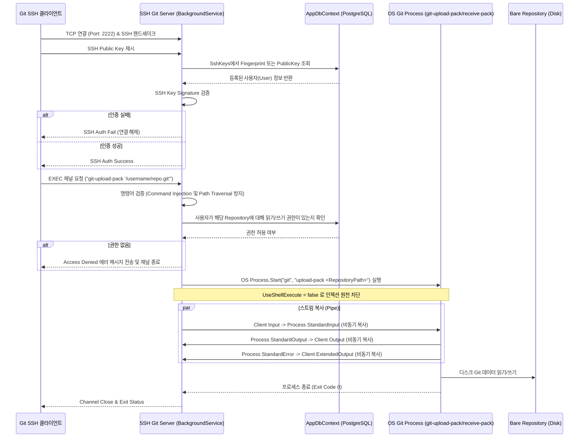
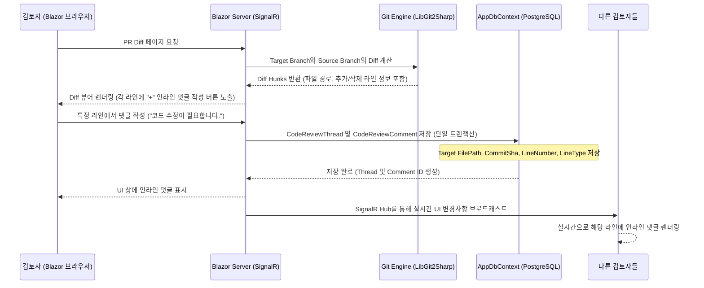

# ARCHITECTURE.md

## Component Boundaries

1. **Web Interface (UI)**: Blazor Server 기반 대화형 웹 인터페이스. 리포지토리 브라우징, 이슈 및 풀 리퀘스트(PR) 관리, Diff 뷰어 및 줄 단위 인라인 코드 리뷰 인터페이스 제공.
2. **Git HTTP Server**: ASP.NET Core 미들웨어를 통해 HTTP(S) 프로토콜을 사용한 Git Clone, Push, Pull 동작(`git-receive-pack`, `git-upload-pack` 호출)을 위임 처리.
3. **SSH Git Server (New)**: ASP.NET Core `IHostedService`로 동작하는 SSH 서버. 사용자가 SSH 프로토콜로 리포지토리에 액세스할 때 SSH 공개키를 인증하고, Git 명령어 세션을 리디렉션하여 로컬 `git` 프로세스 표준 입출력 스트림을 중개(Piping).
4. **Core Services**: 프로젝트의 핵심 도메인 로직(사용자 인증, 이슈 트래커, PR 병합 및 관리, SSH 키 관리, 코드 리뷰 스레드 관리).
5. **Git Engine Layer**: LibGit2Sharp를 래핑하여 서버 디스크 상의 베어(Bare) 리포지토리에 접근, 커밋 로그 추출, 파일 트리 열람, Diff 연산 등을 수행.
6. **Data Layer**: EF Core 및 PostgreSQL을 활용한 데이터 액세스 및 엔티티 매핑.

---

## Data Flow

### 1. SSH 기반 Git Operations Flow (Clone/Push/Pull)



### 2. Line-by-line Code Review Flow (인라인 댓글 작성 및 실시간 반영)



---

## DB Schema Design (PostgreSQL / EF Core)

### 1. SSH Key Management Table
사용자가 SSH 키를 등록하고 인증할 수 있는 테이블 구조.

#### `SshKeys`
- `Id`: `int` (PK, Serial)
- `UserId`: `int` (FK to `Users.Id`, Cascade Delete)
- `Title`: `varchar(256)` (키 별칭)
- `PublicKey`: `text` (SSH 공개키 문자열 - e.g. `"ssh-rsa AAAAB3N..."`)
- `Fingerprint`: `varchar(256)` (빠른 해시 검색을 위한 인덱싱된 필드)
- `CreatedAt`: `timestamp`

### 2. Line-by-line Code Review Tables
줄 단위 댓글은 특정 PR(결국 Issue) 내에서 특정 파일, 특정 커밋, 특정 라인을 타겟팅하는 스레드 형태와 그 아래의 대화(댓글) 형태로 모델링한다.

#### `CodeReviewThreads` (스레드 헤더)
- `Id`: `Guid` (PK)
- `IssueId`: `Guid` (FK to `PullRequests.IssueId`, Cascade Delete) - PullRequest 테이블이 IssueId를 PK로 취하므로 IssueId와 외래 키 연동.
- `CommitSha`: `varchar(40)` (댓글이 작성된 기준 커밋 해시)
- `FilePath`: `text` (대상 소스 파일의 리포지토리 기준 상대 경로)
- `StartLine`: `int?` (범위 지정 댓글일 때 시작 라인 번호, 1-based, nullable)
- `EndLine`: `int` (스레드가 속한 타겟 라인 번호, 1-based)
- `LineType`: `varchar(20)` (추가 라인인지 삭제 라인인지 혹은 미수정 라인인지 구분 - `"Addition"`, `"Deletion"`, `"Unchanged"`)
- `IsResolved`: `boolean` (스레드가 해결되었는지 여부)
- `ResolvedByUserId`: `int?` (FK to `Users.Id`, SetNull)
- `IsOutdated`: `boolean` (코드 변경으로 인해 이전 커밋으로 밀려났는지 여부)
- `CreatedAt`: `timestamp`
- `UpdatedAt`: `timestamp`

#### `CodeReviewComments` (스레드 내 개별 댓글)
- `Id`: `Guid` (PK)
- `ThreadId`: `Guid` (FK to `CodeReviewThreads.Id`, Cascade Delete)
- `AuthorId`: `int` (FK to `Users.Id`, Restrict)
- `Content`: `text` (마크다운 지원 댓글 내용)
- `CreatedAt`: `timestamp`
- `UpdatedAt`: `timestamp`

---

## Line Mapping & Outdated Algorithm (라인 매핑 및 Outdated 관리)

PR 브랜치에 신규 커밋이 푸시될 때 기존 코드에 작성되어 있던 댓글들의 처리 방식:

1. **Commit Sticky (커밋 귀속 방식)**:
   - 모든 `CodeReviewThread`는 고유의 `CommitSha`를 저장하고 있다.
   - 사용자가 "댓글 작성 당시 커밋 기준 Diff"를 볼 때는 항상 그 자리에 정확히 댓글이 위치한다.
2. **Outdated 상태 판정 및 Line Shift**:
   - 새로운 커밋이 푸시되어 PR의 Head Commit이 갱신되었을 때, 기존 스레드가 달렸던 파일 내용이 변경되었는지 검사한다.
   - **판정 조건**:
     - 기존 `CommitSha`와 새 `HeadCommitSha` 간의 Diff를 LibGit2Sharp로 계산.
     - 스레드가 걸린 `FilePath`의 `EndLine` 영역이 변경사항(Hunk) 내에 포함되어 줄이 수정되었거나 완전히 삭제된 경우, 해당 스레드를 `IsOutdated = true`로 마킹한다.
     - 변경되지 않고 라인만 이동한 경우(예: 위쪽에 새로운 코드가 추가되어 라인 번호만 밀린 경우), 라인 이동 거리만큼 `EndLine` 및 `StartLine` 번호를 보정(Line Shift)해 준다.
3. **UI 표현**:
   - `IsOutdated == true`인 댓글 스레드는 최신 코드 Diff 화면에서는 인라인으로 보이지 않고, UI 상단의 "아웃데이트된 댓글 보기" 버튼을 눌러 사이드바나 축소된 접기 형태로 확인 가능하다.

---

## Technical Domain Research Findings (기술 도메인 검증 리포트)

### 1. Embedded SSH Server in .NET (FxSsh 라이브러리 검증 및 위임 방식)
- **라이브러리 선정**: .NET용 순수 C# SSH 서버 구현체인 **FxSsh**([Aimeast/FxSsh](https://github.com/Aimeast/FxSsh))를 사용한다. 이 라이브러리는 `Public Key Authentication`과 `EXEC` 명령 파이프라인 처리를 가볍고 확장하기 쉽게 지원한다. (신뢰성 레벨: **HIGH**)
- **SSH 포트 리스닝**: `IHostedService`를 통해 `Program.cs`에서 백그라운드로 시작되며, 기본 22번 포트가 운영체제에 의해 선점되어 있을 경우 포트 `2222` 등을 할당해 바인딩한다.
- **Git 명령어 분석 및 탈옥 방지**:
  - 클라이언트가 보내는 EXEC 커맨드 예: `git-upload-pack '/username/repo.git'`
  - **1단계 (Command Validation)**: 명령어가 `git-upload-pack` 또는 `git-receive-pack`으로 시작하는지 엄격히 검증. 이 외의 모든 명령어(예: `; rm -rf /`)는 실행을 거부하여 Command Injection 방지.
  - **2단계 (Path Normalization)**: 리포지토리 상대 경로에서 `/username/repo.git` 파트를 추출하고 정규화하여 `Path.GetFullPath` 및 Safe Path Validation을 적용, 상위 디렉터리 접근(`../../`)을 완벽하게 차단한다.
- **프로세스 실행 및 스트림 복사**:
  - 쉘을 통하지 않고 다이렉트로 `git` 또는 `git-upload-pack` 실행 파일을 기동 (`ProcessStartInfo.UseShellExecute = false`).
  - 프로세스의 `StandardInput`, `StandardOutput`, `StandardError` 스트림을 SSH 채널의 Input, Output, ExtendedOutput 스트림과 비동기적으로 중개하기 위해 다음과 같은 루프 또는 `Stream.CopyToAsync` 타스크를 태운다:
    ```csharp
    var stdinTask = channel.InputStream.CopyToAsync(process.StandardInput.BaseStream, cancellationToken);
    var stdoutTask = process.StandardOutput.BaseStream.CopyToAsync(channel.OutputStream, cancellationToken);
    var stderrTask = process.StandardError.BaseStream.CopyToAsync(channel.ExtendedOutputStream, cancellationToken);
    await Task.WhenAll(stdinTask, stdoutTask, stderrTask);
    ```
  - 프로세스가 종료되면 `ExitCode`를 캡처하여 SSH 채널에 전달하고 세션을 해제한다.

---

## Build Order (빌드 순서 개정)

1. **Auth & Database Foundation**: 사용자 정보 및 기본 DB 환경 구축
2. **Repository & Git Engine Layer**: Bare 리포지토리 생성 및 LibGit2Sharp를 통한 파일 조회/Diff 기본 기능
3. **Git HTTP Server**: HTTP 방식의 Clone/Push/Pull 구축 (클라이언트 동작 확인)
4. **SSH Git Server Integration**: (v1.1 신규)
   - `SshKeys` 스키마 및 API 구현
   - FxSsh 백그라운드 호스팅 및 공개키 DB 연계 인증
   - Git EXEC 명령어 파싱 및 OS Git 프로세스 스트림 복사/파이핑 구현
5. **Issues & Kanban Board**: 이슈 생성, 상태 이동 및 드래그앤드롭 보드 UI
6. **Pull Requests & Line-by-line Code Review**: (v1.1 신규)
   - PR 기본 생성 및 LibGit2Sharp를 통한 트리 비교 (Diff Hunk 파서)
   - Blazor Server용 인라인 댓글 작성 UI 구성
   - `CodeReviewThreads` / `CodeReviewComments` 스키마 모델 설계 및 SignalR 실시간 갱신 적용
   - 신규 커밋 푸시 시 Outdated 판정 및 Line Shift 알고리즘 연동
