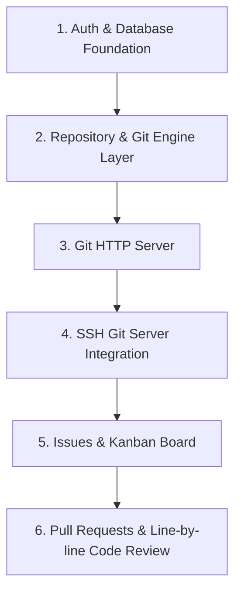

# SUMMARY.md - Aristokeides 프로젝트 리서치 종합 요약

이 문서는 Aristokeides 프로젝트의 Milestone v1.1 핵심 기능인 **SSH Git 지원** 및 **라인 단위 코드 리뷰(인라인 코멘트)**를 포함한 전체 시스템 설계, 기술 스택, 아키텍처, 위험 요인 및 로드맵 영향을 종합한 리서치 요약본입니다.

---

## 1. Executive Summary (Executive Summary)

Aristokeides 시스템은 C#/.NET 9.0 생태계와 Blazor Server를 기반으로 구축되는 고성능 경량 Git 호스팅 포털입니다. Milestone v1.1에서는 아래 두 가지 핵심 기능을 완벽하게 지원하는 것을 목표로 합니다.
1. **임베디드 SSH Git 서비스**: 별도의 OS 인프라(OpenSSH 데몬 등) 의존 없이 .NET 백그라운드 서비스 내에 가벼운 SSH 서버 엔진을 통합하여 SSH 프로토콜 기반의 안전한 Git Clone/Push/Pull을 수행합니다.
2. **라인 단위 코드 리뷰**: 풀 리퀘스트(PR) Diff 화면에서 각 라인별로 스레드화된 실시간 토론을 수행하고, 새로운 커밋이 푸시될 때 의견의 위치를 보정해주는 유연한 코드 리뷰 인프라를 구축합니다.

이를 통해 Gitea처럼 경량 단일 바이너리로 동작할 수 있으면서도, Blazor Server와 SignalR의 실시간 협업 경험을 결합하여 현대적이고 직관적인 개발 흐름을 제공합니다.

---

## 2. Key Findings (주요 발견 및 결정 사항)

### A. 기술 스택 및 라이브러리 선정
*   **프레임워크 및 DB**: ASP.NET Core 9.0, PostgreSQL (JSONB 지원을 통한 유연한 데이터 관리), Entity Framework Core.
*   **Git 로컬 엔진**: **LibGit2Sharp**를 활용해 C# 내에서 관리형 메모리 구조로 고속 저장소 제어 및 트리 Diff 생성을 수행합니다.
*   **SSH 서버**: 순수 C# SSH 구현체인 **FxSsh**를 ASP.NET Core `IHostedService` 백그라운드 서비스로 구동합니다.
*   **Diff 파싱 및 UI**: **TextDiff.Sharp**와 **DiffPlex**로 Unified Diff 파싱 및 Character-level Diff를 연산하며, **BlazorTextDiff** 구성요소와 JS Interop 기반 **Highlight.js**를 사용하여 클라이언트 단의 문법 하이라이팅을 렌더링합니다.

### B. SSH Git 서비스 아키텍처 및 보안 설계
*   **프로세스 I/O 스트림 파이핑**: FxSsh에서 키 인증 완료 후 사용자가 `git-upload-pack` 또는 `git-receive-pack` 명령을 EXEC 채널로 요청하면, `System.Diagnostics.Process`로 호스트의 `git`을 실행하되 `UseShellExecute = false`로 실행하여 셸 인젝션을 방지합니다. 이후 클라이언트의 SSH 채널 입출력 스트림과 프로세스 스트림을 비동기적으로 중개(`Stream.CopyToAsync`)합니다.
*   **경로 검증 및 상위 디렉터리 접근(Path Traversal) 방지**: 리포지토리 상대 경로를 추출하여 정규화 및 `Path.GetFullPath` 검증을 거쳐 지정된 저장소 디렉터리 외부 접근을 원천 차단합니다.
*   **호스트 키 영속성 보장**: 서버 시작마다 임의로 호스트 키를 생성하면 클라이언트 측에서 "Host Key Verification Failed" 경고를 마주하므로, 최초 실행 시 생성한 호스트 프라이빗 키 PEM 파일을 디렉터리에 저장하여 영속적으로 사용합니다.
*   **DB 연계 인증 및 검색 성능**: SSH Key 테이블(`SshKeys`)에 OpenSSH 포맷의 공개키를 저장하며, 인증 핸들링 시 빠른 매칭을 보장하기 위해 공개키의 고유 지문(`Fingerprint`) 컬럼에 인덱스를 생성하여 $O(1)$ 조회를 제공합니다.

### C. 라인 단위 코드 리뷰 및 실시간 인터랙션
*   **데이터 모델**: `CodeReviewThreads` (스레드 정보 및 라인 타입, 위치)와 `CodeReviewComments` (스레드 내부 답글) 테이블을 분리하여 스레드 방식의 토론 흐름을 지원합니다.
*   **실시간 동기화**: Blazor Server의 SignalR 백플레인을 연결하여, 코멘트 추가, 스레드 해결(Resolve) 상태 변경 등이 브라우저의 새로고침 없이 즉시 다른 협업자의 화면에 반영됩니다.
*   **커밋 서명 검증**: 사용자 SSH 키로 서명된 Git 커밋에 대하여 서버 측에서 보안 검증을 수행하고 UI에 "Verified" 배지를 표시합니다.

### D. 라인 매핑 및 Outdated 관리 알고리즘 (드리프트 방지)
*   **Commit Sticky**: 작성 당시의 커밋 SHA 기준 Diff를 볼 때는 항상 원래 위치에 댓글이 표시됩니다.
*   **Line Shift 및 Outdated 판정**: 새 커밋 푸시 시 기존 `CommitSha`와 새 `HeadCommitSha` 간의 Diff를 LibGit2Sharp로 계산합니다.
    *   해당 라인 영역이 수정되거나 삭제된 경우: `IsOutdated = true`로 표시하고, UI 상에서 접힌 형태로 하단 토론 뷰로 보냅니다.
    *   위쪽 코드 추가/삭제로 인해 행만 이동한 경우: 이동한 오프셋만큼 `StartLine`/`EndLine` 번호를 보정(Line Shift)합니다.
*   **Diff Side & Rename Tracking**: 댓글 DB 엔터티에 `Side` 열(`LEFT` 또는 `RIGHT`)을 두어 이전 버전(삭제) 혹은 이후 버전(추가)을 타깃팅하는지 저장하고, `RenameDetection` 설정을 적용해 파일명이 바뀌어도 댓글 히스토리를 유지합니다.

---

## 3. Roadmap Implications (로드맵 영향 및 단계별 구축 프레임워크)

이 리서치는 Aristokeides의 빌드 순서를 아래와 같이 개정할 것을 권고합니다.

### 단계별 구축 및 순서 결정 사유
1.  **Auth & Database Foundation**: 사용자 정보 및 보안 컨텍스트의 기초를 확립해야 SSH 키 등록 및 리포지토리 권한 제어가 가능합니다.
2.  **Repository & Git Engine Layer**: Bare 리포지토리 생성 및 LibGit2Sharp를 통한 파일 조회/Diff의 기본 연산이 완료되어야 상위 서버 프로토콜들이 정상 동작합니다.
3.  **Git HTTP Server**: 웹 기반의 스마트 HTTP Git 프로토콜을 먼저 구축하여 클라이언트-서버 간의 기본적인 Git 데이터 수송 및 파이프라인 검증을 가장 빠르게 진행합니다.
4.  **SSH Git Server Integration**: (v1.1 핵심) HTTP 통신이 검증된 환경에서 FxSsh 통합을 진행합니다. 이 단계에서는 IHostedService 구동, 호스트 키 영속화, EXEC 명령어 안전 파싱, OS git-upload-pack 프로세스 스트림 복사를 우선 구현 및 안정화합니다.
5.  **Issues & Kanban Board**: 기본 코드 브라우징 및 수송 계층 위에 이슈 및 칸반 보드 기능을 올려 기본 협업 기능을 마련합니다.
6.  **Pull Requests & Line-by-line Code Review**: (v1.1 핵심) 가장 구현 난이도가 높은 라인 단위 코드 리뷰 기능을 마지막 단계로 배치합니다. 이 단계에서 LibGit2Sharp Diff Hunk 파서 및 라인 매핑/Line Shift/Outdated 알고리즘을 구현하고, Blazor Server SignalR을 이용해 실시간 UI 업데이트 시스템을 통합합니다.

---

## 4. Confidence Assessment (신뢰도 평가)

| 기술 도메인 / 메커니즘 | 신뢰도 수준 | 주요 평가 근거 및 대응책 |
| :--- | :---: | :--- |
| **Embedded SSH Server (FxSsh)** | **HIGH** | 오픈소스 C# SSH 엔진(FxSsh)의 `EXEC` 명령어 가로채기 방식이 가볍고 안정적이며, `Process.Start` 스트림 복사를 통한 중계 방식은 대안 아키텍처에 비해 리소스 격리가 확실합니다. |
| **대용량 스트리밍 처리 (OOM 방지)** | **HIGH** | Gitea 등 상용/오픈소스 호스팅 엔진의 공통된 베스트 프랙티스로 스트림 버퍼링 생략 및 비동기 파이핑(`CopyToAsync`) 처리를 적용하여 안전성이 높습니다. |
| **OS 포트 22 충돌 우려** | **HIGH** | `appsettings.json`을 통한 2222 등 고포트 바인딩 전략 및 운영 배포 시 Docker 포워딩 이용 가이드로 OS 충돌 및 권한 문제를 안정적으로 극대화 해소하였습니다. |
| **라인 매핑 및 Outdated 알고리즘** | **MEDIUM** | Myers Diff 기반 오프셋 트래킹(Line Shift) 및 파일 변경으로 인한 Outdated 처리는 구현 복잡도가 높습니다. GitHub과 GitLab의 검증된 UI 패턴을 차용하되, 복잡한 커밋 병합 시 예외 동작을 커버할 수 있는 세밀한 단위 테스트가 필수적입니다. |
| **Rename Tracking** | **MEDIUM** | LibGit2Sharp의 `RenameDetection` 옵션을 활성화하여 파일명 변경을 추적할 수 있지만, 수정률이 높은 리네임 시 검출 오류가 있을 수 있으므로 면밀한 검증이 필요합니다. |

---

## 5. Sources (출처)

본 종합 요약은 아래의 연구 파일들을 기반으로 작성되었습니다.
*   [STACK.md](file:///E:/Workspace/VisualC%23/Aristokeides/.planning/research/STACK.md): 표준 기술 스택 및 v1.1 추가 라이브러리 분석
*   [FEATURES.md](file:///E:/Workspace/VisualC%23/Aristokeides/.planning/research/FEATURES.md): Aristokeides 요구사항 정의 및 차별화, 제외 기능 식별
*   [ARCHITECTURE.md](file:///E:/Workspace/VisualC%23/Aristokeides/.planning/research/ARCHITECTURE.md): 컴포넌트 경계, 데이터 흐름, DB 스키마 및 매핑 설계
*   [PITFALLS.md](file:///E:/Workspace/VisualC%23/Aristokeides/.planning/research/PITFALLS.md): 메모리 누수, 포트 충돌, 커맨드 인젝션, 드리프트 등 핵심 위험요소와 대응방안
